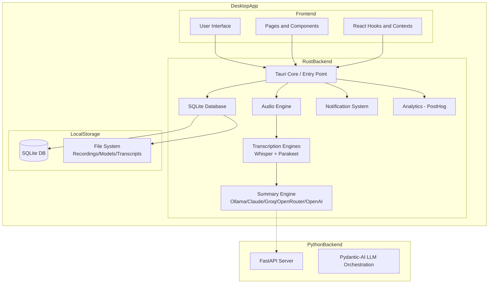
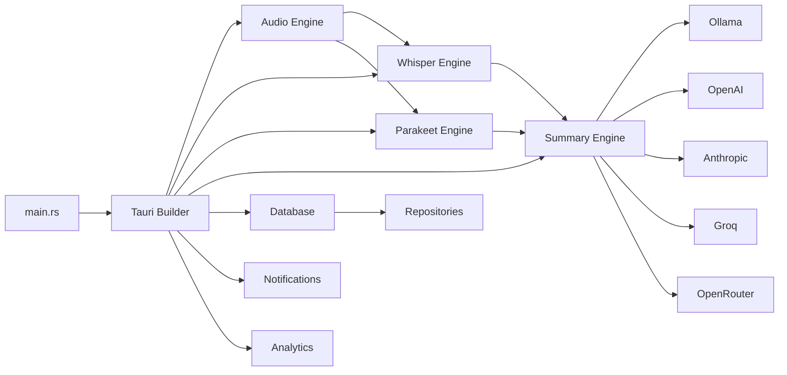

> Part of [Codebase Map](CODEBASE_MAP.md)

# Architecture

## System Overview

Meetily is a **privacy-first AI meeting assistant** desktop application built with [Tauri v2](https://tauri.app/). It captures, transcribes, and summarizes meetings entirely on the user's local machine. The architecture consists of:

1. **Rust Backend (Tauri)**: Handles audio capture, transcription (Whisper/Parakeet), AI summarization (Ollama/Claude/Groq/OpenRouter/OpenAI), SQLite database storage, notifications, and system tray integration.
2. **Next.js Frontend**: Provides the UI for meeting management, transcript editing, settings configuration, and onboarding flows.
3. **Python Backend** (optional): A FastAPI-based server for AI summarization services, using Pydantic-AI for LLM orchestration.

All data stays local — no cloud dependency unless explicitly configured for AI summaries.

## High-Level Architecture Diagram



## Component Details

### Frontend (Next.js + React)

| Layer | Technology | Purpose |
|-------|-----------|---------|
| Framework | Next.js 14.x | App router, server components, API routes |
| UI Library | React 18 + TypeScript | Component-based UI with type safety |
| Styling | Tailwind CSS + Radix UI | Utility-first styling + headless accessible components |
| State | React Context + custom hooks | Global state management (recording, transcripts, config) |
| Editor | BlockNote + TipTap | Rich text editing for meeting notes/summaries |
| Desktop Wrapper | Tauri v2 + Rust | Native system integration, audio capture, file I/O |

### Backend (Rust — Tauri App)

| Module | Files | Purpose |
|--------|-------|---------|
| **Audio Engine** | `audio/mod.rs`, `capture/`, `stream.rs`, `pipeline.rs` | Microphone + system audio capture, mixing, VAD, noise suppression |
| **Transcription** | `whisper_engine/`, `parakeet_engine/` | Whisper.cpp bindings (Metal/CUDA/Vulkan) + Parakeet ONNX model |
| **Summary** | `summary/summary_engine/`, `ollama/`, `openai/`, `anthropic/`, `groq/`, `openrouter/` | LLM integration for meeting summaries with multiple providers |
| **Database** | `database/manager.rs`, `models.rs`, `repositories/` | SQLite via sqlx, meeting/transcript/summary data models and CRUD |
| **Notifications** | `notifications/manager.rs`, `commands.rs` | System notifications with DND awareness and user preferences |
| **Analytics** | `analytics/analytics.rs` | PostHog integration for product analytics |
| **Onboarding** | `onboarding.rs` | First-launch setup flow state |

### Python Backend (Optional)

| Component | Technology | Purpose |
|-----------|-----------|---------|
| Framework | FastAPI + uvicorn | REST API server |
| LLM Orchestration | Pydantic-AI 0.2.x | Multi-provider AI agent framework |
| Database | aiosqlite | Async SQLite access |
| Local LLM | ollama Python SDK | Ollama model management |

## Directory Structure

```
meetily/
├── backend/                          # Python backend (optional AI server)
│   ├── app/                          # FastAPI application code
│   ├── whisper-custom/               # Custom Whisper server modifications
│   └── requirements.txt              # Python dependencies
├── docs/                             # Documentation and architecture maps
│   └── CODEBASE_MAP_*.md             # Auto-generated codebase documentation
├── frontend/                         # Tauri app (Rust + Next.js)
│   ├── src/                          # Next.js frontend application
│   │   ├── app/                      # Next.js pages and layouts
│   │   ├── components/               # React UI components
│   │   ├── hooks/                    # Custom React hooks
│   │   ├── contexts/                 # React context providers
│   │   ├── services/                 # Browser-side API services (IndexedDB)
│   │   └── types/                    # TypeScript type definitions
│   └── src-tauri/                    # Rust backend for Tauri
│       ├── src/                      # Rust source code (main entry point)
│       │   ├── audio/                # Audio capture and processing engine
│       │   ├── whisper_engine/        # Whisper.cpp integration
│       │   ├── parakeet_engine/       # Parakeet ONNX model integration
│       │   ├── summary/              # AI summarization engine
│       │   ├── database/             # SQLite database layer
│       │   ├── notifications/         # System notification system
│       │   ├── analytics/             # PostHog analytics
│       │   └── main.rs               # Application entry point
│       ├── Cargo.toml                # Rust dependencies
│       └── tauri.conf.json           # Tauri configuration
├── llama-helper/                     # Separate Rust crate (helper utilities)
├── openspec/                         # OpenSpec change management
└── scripts/                          # Build and utility scripts
```

## Component Relationships

### Rust Backend Module Dependency Graph



### Frontend-to-Rust Command Flow

The frontend communicates with the Rust backend through Tauri's command system:

1. **Frontend** calls `invoke()` with a Tauri command name
2. **Tauri** routes to the registered handler in `lib.rs`
3. **Rust** executes native operation (audio capture, transcription, DB query)
4. **Result** is serialized and returned to frontend as JSON

## Technology Stack

### Rust Backend Dependencies
| Category | Library | Purpose |
|----------|---------|---------|
| Desktop Framework | tauri v2.6.x | Cross-platform desktop app framework |
| Audio Capture | cpal + cidre (macOS) | Microphone and system audio capture |
| Transcription | whisper-rs v0.13.x | Whisper.cpp Rust bindings |
| ONNX Runtime | ort v2.0.x | Parakeet model inference |
| Database | sqlx v0.8 | Compile-time checked SQLite queries |
| Async Runtime | tokio v1.32+ | Asynchronous runtime |
| Serialization | serde + serde_json | JSON serialization |
| Logging | env_logger + tracing | Structured logging |
| Noise Suppression | nnnoiseless (RNNoise) | Neural noise suppression |
| VAD | Custom implementation | Voice Activity Detection |
| Audio Processing | dasp, rubato, rayon | Resampling, mixing, parallel processing |

### Frontend Dependencies
| Category | Library | Purpose |
|----------|---------|---------|
| Framework | next.js v14.2.x | React framework with app router |
| UI Components | radix-ui + shadcn | Headless accessible UI primitives |
| Styling | tailwindcss + framer-motion | Utility CSS + animations |
| Text Editor | blocknote + tiptap | Rich text editing for notes |
| State Management | react-hook-form + zod | Form handling and validation |
| Desktop API | @tauri-apps/api v2.6.x | Tauri IPC bridge |
| Analytics | PostHog (via tauri plugin) | Product analytics |

### Python Backend Dependencies
| Library | Purpose |
|---------|---------|
| fastapi + uvicorn | REST API framework and ASGI server |
| pydantic-ai v0.2.x | LLM orchestration framework |
| aiosqlite | Async SQLite access |
| ollama | Ollama Python client |

## Concurrency Model

The Rust backend uses **tokio async runtime** extensively:
- Audio capture runs in dedicated async tasks
- Transcription chunks are processed via parallel processor with rayon thread pool
- Database operations use sqlx's async interface
- Recording state is managed through `Arc<RwLock<T>>` for shared mutable state
- System tray and notification handling use tokio channels

## Build Features (GPU Acceleration)

| Feature | Platform | Effect |
|---------|----------|--------|
| `default` / `platform-default` | All | Auto-selects best backend per platform |
| `metal` + `coreml` | macOS | Apple Silicon GPU + ML acceleration |
| `cuda` | Windows/Linux | NVIDIA CUDA GPU acceleration |
| `vulkan` | Windows/Linux | AMD/Intel Vulkan GPU acceleration |
| `hipblas` | Linux | AMD ROCm HIP acceleration |
| `openblas` | Windows/Linux | CPU optimization with OpenBLAS |

## Security & Privacy Design

- **Local-first**: All recordings, transcripts, and summaries stored in app_data directory
- **Optional analytics**: PostHog analytics opt-in with consent switch
- **No telemetry by default**: Application works fully offline without any cloud services
- **GDPR-ready**: Data export and deletion support through database layer