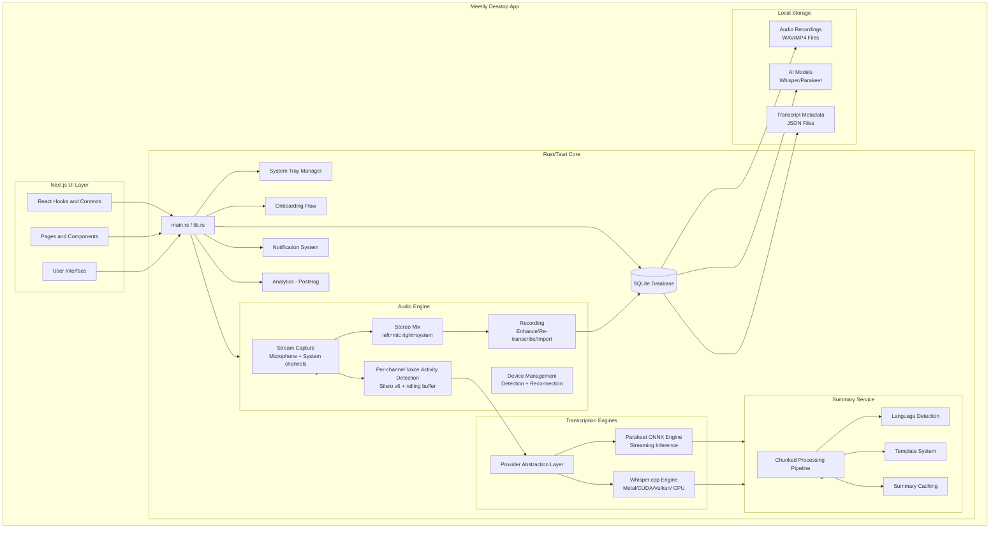
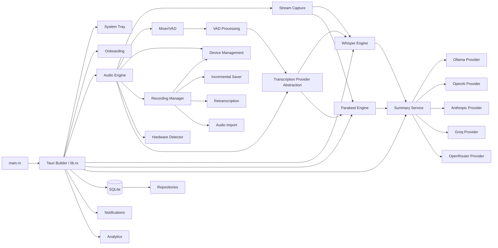

> Part of [Codebase Map](CODEBASE_MAP.md)

# Architecture

## System Overview

Meetily is a **privacy-first AI meeting assistant** desktop application built with [Tauri v2](https://tauri.app/). It captures, transcribes, and summarizes meetings entirely on the user's local machine. The architecture consists of:

1. **Rust Backend (Tauri)**: Handles audio capture (microphone + system), professional audio mixing, Voice Activity Detection (VAD), transcription via Whisper.cpp/Parakeet ONNX streaming, AI summarization through multiple LLM providers (Ollama, Claude, Groq, OpenAI, OpenRouter), SQLite database storage, desktop notifications, and system tray integration.
2. **Next.js Frontend**: Provides the UI for meeting management, transcript editing, settings configuration, onboarding flows, and real-time audio level monitoring.

The audio engine captures **microphone and system-audio channels separately** (recorded as stereo, left=mic / right=system) with per-channel VAD. All data stays local by default — no cloud dependency unless explicitly configured for AI summaries.

> **Note:** A legacy Python/FastAPI backend previously existed but has been **removed** (commit "Remove old backend project"). All summarization/transcription is now native Rust; the only residual HTTP is the built-in `llama-helper` sidecar and cloud LLM providers.

## High-Level Architecture Diagram



## Component Details

### Frontend (Next.js + React)

| Layer | Technology | Purpose |
|-------|-----------|---------|
| Framework | Next.js 14.x | App router, server components, API routes |
| UI Library | React 18 + TypeScript | Component-based UI with type safety |
| Styling | Tailwind CSS + Radix UI + Framer Motion | Utility-first styling + animations |
| State | React Context (SidebarProvider) + custom hooks | Global state for meetings, recording, transcripts |
| Editor | BlockNote + TipTap | Rich text editing for meeting notes/summaries |
| Desktop Wrapper | Tauri v2.x + Rust | Native system integration, audio capture, file I/O |
| Form Handling | react-hook-form + zod | Validation and form state management |

### Backend (Rust — Tauri App)

The backend has evolved significantly with modular audio processing:

| Module | Files | Purpose |
|--------|-------|---------|
| **Entry Point** | `lib.rs`, `main.rs`, `tray.rs`, `onboarding.rs` | Tauri builder, command registration, system tray, onboarding flow |
| **Audio Capture** | `audio/capture/`, `audio/stream.rs`, `audio/system_audio_*.rs` | Microphone + system audio stream creation (cpal, CoreAudio, WASAPI) |
| **Audio Mixing** | `audio/pipeline.rs`, `audio/ffmpeg_mixer.rs` | Professional RMS-based mixing, buffer synchronization, clipping prevention |
| **VAD Processing** | `audio/vad.rs` | Voice Activity Detection, speech segment extraction (16kHz mono) |
| **Device Management** | `audio/devices/`, `audio/device_detection.rs`, `audio/device_monitor.rs` | Device enumeration, platform-specific detection, disconnect/reconnect monitoring |
| **Recording Manager** | `audio/recording_manager.rs`, `audio/recording_state.rs`, `audio/recording_commands.rs` | High-level recording orchestration, state management, Tauri commands |
| **Audio Processing** | `audio/audio_processing.rs`, `audio/post_processor.rs` | Normalization, noise suppression (RNNOISE), spectral subtraction, filters |
| **Buffer Management** | `audio/buffer_pool.rs`, `audio/batch_processor.rs` | Audio buffer pooling for memory efficiency, batched metrics collection |
| **Incremental Saving** | `audio/incremental_saver.rs` | Checkpoint-based audio saving for crash recovery |
| **Transcription Provider** | `audio/transcription/` | Abstract STT provider interface, engine lifecycle management |
| **Whisper Engine** | `whisper_engine/`, `whisper_engine/parallel_processor.rs` | Whisper.cpp bindings with GPU acceleration (Metal/CUDA/Vulkan), parallel chunk processing |
| **Parakeet Engine** | `parakeet_engine/` | ONNX Runtime inference for Parakeet streaming model |
| **Summary Service** | `summary/service.rs`, `summary/processor.rs`, `summary/language_detection.rs`, `summary/metadata.rs` | Multi-provider AI summarization with chunked processing, language detection, caching |
| **Template System** | `summary/template_commands.rs`, `summary/templates/` | Customizable summary templates with validation |
| **AI Providers** | `ollama/`, `openai/`, `anthropic/`, `groq/`, `openrouter/` | Provider-specific LLM API clients and configuration |
| **Database Layer** | `database/manager.rs`, `database/models.rs`, `database/repositories/` | SQLite via sqlx, meeting/transcript/summary data models with repository pattern |
| **Notifications** | `notifications/manager.rs`, `notifications/commands.rs` | System notifications with DND awareness and user preferences |
| **Analytics** | `analytics/analytics.rs` | PostHog integration for product analytics (opt-in) |
| **Hardware Detection** | `audio/hardware_detector.rs` | Auto-detects CPU cores, GPU type (Metal/CUDA/Vulkan), memory → recommends Whisper config |

### Python Backend Archive

**Removed.** The `backend/` FastAPI + Pydantic-AI server was deleted (commit "Remove old backend project"). No Python runtime is required for the app; the only optional Python use is `uv` for the Silero VAD model during build.

## Directory Structure

```
meetily/
├── docs/                             # Documentation and architecture maps
│   └── CODEBASE_MAP_*.md             # Auto-generated codebase documentation
├── frontend/                         # Tauri app (Rust + Next.js)
│   ├── src/                          # Next.js frontend application
│   │   ├── app/                      # Next.js pages and layouts
│   │   ├── components/               # React UI components
│   │   ├── hooks/                    # Custom React hooks
│   │   ├── contexts/                 # React context providers
│   │   ├── services/                 # Browser-side API services (IndexedDB)
│   │   └── types/                    # TypeScript type definitions
│   └── src-tauri/                    # Rust backend for Tauri
│       ├── src/                      # Rust source code
│       │   ├── audio/                # Audio capture and processing engine
│       │   │   ├── capture/          # Microphone + system stream creation
│       │   │   ├── devices/          # Device enumeration and config
│       │   │   │   └── platform/     # Windows WASAPI, macOS CoreAudio, Linux ALSA
│       │   │   ├── transcription/    # STT provider abstraction layer
│       │   │   ├── audio_v2/         # ORPHANED/dead next-gen audio pipeline (NOT declared)
│       │   │   ├── pipeline.rs       # Per-channel VAD + stereo mixing
│       │   │   ├── stream.rs         # Audio stream management
│       │   │   ├── recording_*.rs    # Recording state, commands, preferences, saver
│       │   │   ├── device_detection.rs  # Input device kind detection (BT/wired/virtual)
│       │   │   ├── device_monitor.rs    # Device disconnect/reconnect monitoring
│       │   │   ├── hardware_detector.rs # CPU/GPU/memory profiling for Whisper config
│       │   │   ├── vad.rs            # Silero VAD v6 (streaming + batch + rolling buffer)
│       │   │   ├── decoder.rs        # Audio file decoding (ffmpeg fallback)
│       │   │   ├── incremental_saver.rs # Checkpoint-based saving for crash recovery
│       │   │   ├── retranscription.rs   # "Enhance" re-transcribe stored audio (stereo split)
│       │   │   ├── import.rs         # Import external audio files as meetings
│       │   │   ├── post_processor.rs # Text cleanup and normalization
│       │   │   ├── buffer_pool.rs    # Memory-efficient audio buffer pooling
│       │   │   ├── batch_processor.rs # Batch processing with metrics
│       │   │   ├── async_logger.rs   # Async logging infrastructure
│       │   │   └── system_audio_*.rs # System audio detection and monitoring
│       │   ├── whisper_engine/       # Whisper.cpp integration
│       │   ├── parakeet_engine/      # Parakeet ONNX model integration
│       │   ├── summary/              # AI summarization engine
│       │   │   └── templates/        # Customizable summary templates
│       │   ├── database/             # SQLite data layer
│       │   │   └── repositories/     # Repository pattern implementations
│       │   ├── notifications/        # System notification system
│       │   ├── analytics/            # PostHog analytics
│       │   ├── api/                  # IPC + legacy HTTP client + shared DTOs
│       │   ├── ollama/               # Ollama LLM provider (metadata)
│       │   ├── openai/               # OpenAI LLM provider
│       │   ├── anthropic/            # Anthropic (Claude) LLM provider
│       │   ├── groq/                 # Groq LLM provider
│       │   ├── openrouter/           # OpenRouter LLM provider
│       │   ├── main.rs               # Application entry point
│       │   ├── lib.rs                # Tauri builder + command registration
│       │   ├── tray.rs               # System tray management
│       │   └── onboarding.rs         # First-launch setup flow
│       ├── Cargo.toml               # Rust dependencies
│       └── tauri.conf.json          # Tauri configuration
├── llama-helper/                     # Sidecar Rust crate (built-in AI LLM)
├── openspec/                         # OpenSpec change management workflow
├── scripts/                          # Build and utility scripts (env-cuda, etc.)
└── .agents/skills/                   # Agent skills
```

## Component Relationships

### Rust Backend Module Dependency Graph



### Frontend-to-Rust Command Flow

The frontend communicates with the Rust backend through Tauri's command/event system:

1. **Command (Frontend → Rust)**: `invoke('command_name', { args })` triggers a Rust function
2. **Tauri Routing**: `#[tauri::command]` handlers in `lib.rs` route to module functions
3. **Native Operation**: Rust executes the operation (audio capture, transcription, DB query)
4. **Event (Rust → Frontend)**: `app.emit("event-name", payload)` pushes updates to React
5. **Result**: Responses returned as JSON or via event payloads

### Audio Pipeline Architecture

```
Raw Audio (Mic + System)
         ↓
┌────────────────────────────────────────────────────────────┐
│              Audio Pipeline Manager                         │
│  (frontend/src-tauri/src/audio/pipeline.rs)                │
└─────────────┬──────────────────────────┬───────────────────┘
              ↓                          ↓
    ┌─────────────────┐        ┌─────────────────────┐
    │ Recording Path  │        │ Transcription Path  │
    │ (Pre-mixed)     │        │ (VAD-filtered)      │
    └─────────────────┘        └─────────────────────┘
              ↓                          ↓
    RecordingSaver.save()      WhisperEngine.transcribe()
```

## Technology Stack

### Rust Backend Dependencies

| Category | Library | Purpose |
|----------|---------|---------|
| Desktop Framework | tauri v2.x | Cross-platform desktop app framework |
| Audio Capture | cpal + cidre (macOS) | Microphone and system audio capture |
| Transcription | whisper-rs v0.13.x | Whisper.cpp Rust bindings |
| ONNX Runtime | ort v2.0.x | Parakeet model inference |
| Database | sqlx v0.8 | Compile-time checked SQLite queries |
| Async Runtime | tokio v1.32+ | Asynchronous runtime |
| Serialization | serde + serde_json | JSON serialization |
| Logging | env_logger + tracing | Structured logging with async logger |
| Noise Suppression | nnnoiseless (RNNoise) | Neural noise suppression |
| VAD | Custom implementation | Voice Activity Detection |
| Audio Processing | dasp, rubato, rayon | Resampling, mixing, parallel processing |
| Buffer Management | VecDeque, custom pool | Efficient audio buffer handling |

### Frontend Dependencies

| Category | Library | Purpose |
|----------|---------|---------|
| Framework | next.js v14.x | React framework with app router |
| UI Components | radix-ui + shadcn | Headless accessible UI primitives |
| Styling | tailwindcss + framer-motion | Utility CSS + animations |
| Text Editor | blocknote + tiptap | Rich text editing for notes |
| State Management | react-hook-form + zod | Form handling and validation |
| Desktop API | @tauri-apps/api v2.x | Tauri IPC bridge |

### Python Backend Dependencies (Legacy)

| Library | Purpose |
|---------|---------|
| fastapi + uvicorn | REST API framework and ASGI server |
| pydantic-ai v0.2.x | LLM orchestration framework |
| aiosqlite | Async SQLite access |
| ollama | Ollama Python client |

## Concurrency Model

The Rust backend uses **tokio async runtime** extensively:
- Audio capture runs in dedicated async tasks per device (mic + system)
- Audio mixing uses ring buffers with `VecDeque` for sample alignment across streams
- Transcription chunks are processed via parallel processor with rayon thread pool
- Database operations use sqlx's async interface
- Recording state is managed through `Arc<RwLock<T>>` and `Arc<AtomicBool>` for shared mutable state
- Device monitoring uses mpsc channels for event-driven reconnection
- Post-processing uses unbounded channels for decoupled pipeline stages
- Summary cancellation uses `CancellationToken` for graceful shutdown

## Build Features (GPU Acceleration)

| Feature | Platform | Effect |
|---------|----------|--------|
| `default` / `platform-default` | All | Auto-selects best backend per platform |
| `metal` + `corecl` | macOS | Apple Silicon GPU + CoreML acceleration |
| `cuda` | Windows/Linux | NVIDIA CUDA GPU acceleration |
| `vulkan` | Windows/Linux | AMD/Intel Vulkan GPU acceleration |
| `hipblas` | Linux | AMD ROCm HIP acceleration |
| `openblas` | Windows/Linux | CPU optimization with OpenBLAS |

## Security & Privacy Design

- **Local-first**: All recordings, transcripts, and summaries stored in app_data directory
- **Optional analytics**: PostHog analytics opt-in with consent switch
- **No telemetry by default**: Application works fully offline without any cloud services
- **GDPR-ready**: Data export and deletion support through database layer
- **Privacy-by-design**: No data leaves the machine unless user explicitly configures cloud AI

## Recent Changes (since 2026-07-13 mapping)

Highlights of what changed since the previous map:

| Area | Change |
|------|--------|
| **Mic/System channel separation** | Recording now captures mic + system as separate channels, recorded stereo (left=mic, right=system), stored via `source_device` on transcripts, displayed distinctly in the UI, and split again in re-transcription. |
| **VAD rewritten** | `vad.rs` now uses **Silero VAD v6** (ONNX), a **unified `VadConfig`** (`live()`/`batch()`), and a **rolling buffer** for speech-onset recovery. |
| **Transcription provider abstraction** | New `audio/transcription/` subpackage (`engine.rs`, `provider.rs`, `worker.rs`, `whisper_provider.rs`, `parakeet_provider.rs`) wraps the engines for live transcription. |
| **Enhance / Re-transcription** | `audio/retranscription.rs` re-processes stored audio per-channel, cancellable, with atomic DB replacement. |
| **Audio Import** | `audio/import.rs` imports external audio as meetings (beta-gated). |
| **LLM debug logging** | New `summary/debug_log.rs` writes a file per LLM call into the meeting folder. |
| **Frontend** | Paginated transcripts (`usePaginatedTranscripts` + `VirtualizedTranscriptView` infinite scroll); mic/sys visual separation in transcript UI. |
| **Build/GPU** | New `scripts/env-cuda.*` and `frontend/build-gpu.*`/`dev-gpu.*`; `llama-helper` sidecar built by GPU scripts. |
| **Python backend removed** | `backend/` deleted; all summarization/transcription is native Rust. |
| **DB schema** | `transcripts.source_device` column added (2026-07); paginated transcript queries. |
