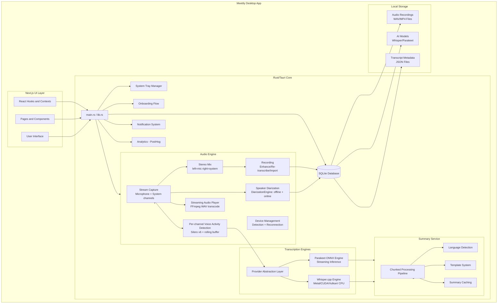
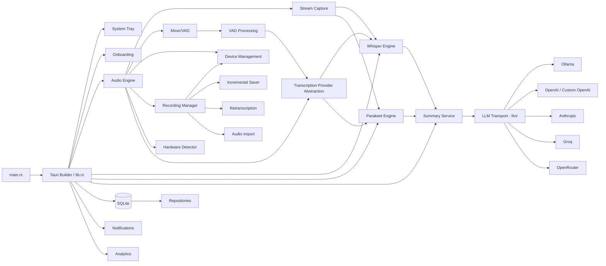

> Part of [Codebase Map](CODEBASE_MAP.md)

# Architecture

## System Overview

Meetily is a **privacy-first AI meeting assistant** desktop application built with [Tauri v2](https://tauri.app/). It captures, transcribes, and summarizes meetings entirely on the user's local machine. The architecture consists of:

1. **Rust Backend (Tauri)**: Handles audio capture (microphone + system), professional audio mixing, Voice Activity Detection (VAD), transcription via Whisper.cpp/Parakeet ONNX streaming, AI summarization through multiple LLM providers (Ollama, Claude, Groq, OpenAI, OpenRouter), SQLite database storage, desktop notifications, and system tray integration.
2. **Next.js Frontend**: Provides the UI for meeting management, transcript editing, settings configuration, onboarding flows, and real-time audio level monitoring.

The audio engine captures **microphone and system-audio channels separately** (recorded as stereo, left=mic / right=system) with per-channel VAD. All data stays local by default — no cloud dependency unless explicitly configured for AI summaries.

> **Note:** A legacy Python/FastAPI backend previously existed but has been **removed** (commit "Remove old backend project"). All summarization/transcription is now native Rust; the only residual HTTP is the built-in `llama-helper` sidecar and cloud LLM providers.

## High-Level Architecture Diagram


```mermaid
graph TB
    subgraph DesktopApp["Meetily Desktop App"]
        subgraph Frontend["Next.js UI Layer"]
            UI[User Interface]
            Pages[Pages and Components]
            Hooks[React Hooks and Contexts]
        end
        
        subgraph RustCore["Rust/Tauri Core"]
            Entry[main.rs / lib.rs]
            Tray[System Tray Manager]
            Onboarding[Onboarding Flow]
            
            subgraph AudioEngine["Audio Engine"]
                Capture[Stream Capture<br/>Microphone + System channels]
                VAD[Per-channel Voice Activity Detection<br/>Silero v6 + rolling buffer]
                Mixer[Stereo Mix<br/>left=mic right=system]
                DeviceMgmt[Device Management<br/>Detection + Reconnection]
                Record[Recording<br/>Enhance/Re-transcribe/Import]
                Diar[Speaker Diarization<br/>DiarizationEngine: offline + online]
                Playback[Streaming Audio Player<br/>FFmpeg WAV transcode]
            end
            
            subgraph TranscriptionEngines["Transcription Engines"]
                Whisper[Whisper.cpp Engine<br/>Metal/CUDA/Vulkan/ CPU]
                Parakeet[Parakeet ONNX Engine<br/>Streaming Inference]
                ProviderAbstraction[Provider Abstraction Layer]
            end
            
            subgraph SummaryService["Summary Service"]
                Processor[Chunked Processing Pipeline]
                LanguageDetect[Language Detection]
                TemplateEngine[Template System]
                Cache[Summary Caching]
            end
            
            DB[(SQLite Database)]
            Notifications[Notification System]
            Analytics[Analytics - PostHog]
        end
        
        subgraph LocalStorage["Local Storage"]
            Recordings[Audio Recordings<br/>WAV/MP4 Files]
            Models[AI Models<br/>Whisper/Parakeet]
            Transcripts[Transcript Metadata<br/>JSON Files]
        end
    end
    
    UI --> Entry
    Pages --> Entry
    Hooks --> Entry
    Entry --> Tray
    Entry --> Onboarding
    Entry --> AudioEngine
    AudioEngine --> Capture
    Capture --> VAD
    VAD --> ProviderAbstraction
    ProviderAbstraction --> Whisper
    ProviderAbstraction --> Parakeet
    Capture --> Mixer
    Mixer --> Record
    Capture --> Diar
    Diar --> DB
    Capture --> Playback
    Record --> DB
    Whisper --> SummaryService
    Parakeet --> SummaryService
    SummaryService --> Processor
    Processor --> LanguageDetect
    Processor --> TemplateEngine
    Processor --> Cache
    Entry --> DB
    DB --> Recordings
    DB --> Models
    DB --> Transcripts
    Entry --> Notifications
    Entry --> Analytics
```

## Component Details

### Frontend (Next.js + React)

| Layer | Technology | Purpose |
|-------|-----------|---------|
| Framework | Next.js 14.x | App router, server components, API routes |
| UI Library | React 18 + TypeScript | Component-based UI with type safety |
| Styling | Tailwind CSS + Radix UI + Framer Motion | Utility-first styling + animations |
| State | React Context (SidebarProvider) + custom hooks | Global state for meetings, recording, transcripts |
| Editor | BlockNote + TipTap | Rich text editing for meeting notes/summaries |
| Desktop Wrapper | Tauri v2.x + Rust | Native system integration, audio capture, file I/O |
| Form Handling | react-hook-form + zod | Validation and form state management |

### Backend (Rust — Tauri App)

Layer-level view; for file- and symbol-level detail use graphify (see [CODEBASE_MAP.md](CODEBASE_MAP.md)). Paths are relative to `frontend/src-tauri/src/`.

| Layer | Location | Purpose |
|-------|----------|---------|
| **Entry Point** | `lib.rs`, `main.rs`, `tray.rs`, `onboarding.rs`, `panic_log.rs` | Tauri builder and command registration (`generate_handler!`), system tray, onboarding, panic hook writing `logs/panic.log` |
| **Audio Capture & Devices** | `audio/capture/`, `audio/devices/`, `audio/devices/platform/` | Microphone + system audio streams (cpal, WASAPI, CoreAudio), device enumeration, disconnect/reconnect monitoring |
| **Audio Pipeline** | `audio/` (pipeline, VAD, mixing, processing modules) | Per-channel Silero VAD, stereo mix (left=mic / right=system), RNNoise/HPF, ducking |
| **Recording** | `audio/recording/` (lifecycle, devices, stop), `audio/recording_commands.rs` | Recording start/stop/pause orchestration; `recording_commands.rs` is the thin Tauri command layer over `audio/recording/` |
| **Saving & Import** | `audio/` (incremental saver, recording saver, retranscription, import) | Checkpoint-based saving for crash recovery, Enhance re-transcription, audio import |
| **Speaker Diarization** | `audio/diarization/` | Offline (batch) + online (streaming) diarization and speaker identity matching behind one entry point, `DiarizationEngine` |
| **Word Alignment** | `audio/word_alignment/` | Post-ASR CTC forced alignment refining per-token timestamps |
| **Audio Playback** | `audio/audio_file.rs` | Meeting recording discovery + FFmpeg WAV transcode for webview streaming |
| **Transcription Provider** | `audio/transcription/` | STT provider abstraction (Whisper, Parakeet), engine lifecycle, provider-aware model-readiness gate |
| **Whisper / Parakeet Engines** | `whisper_engine/`, `parakeet_engine/` | Whisper.cpp bindings with GPU acceleration; ONNX Runtime Parakeet streaming |
| **Summary Service** | `summary/` | Chunked summarization, templates, language detection, provider dispatch |
| **LLM Transport** | `llm/` | Shared pooled HTTP client, bounded retry, provider-agnostic `LlmError` for outbound LLM calls |
| **AI Provider Metadata** | `ollama/`, `openai/`, `anthropic/`, `groq/`, `openrouter/` | Provider-specific model listing and configuration |
| **Database Layer** | `database/`, `database/repositories/` | SQLite via sqlx with a repository pattern; the speaker registry repository is a directory module (`database/repositories/speaker/`) |
| **Notifications** | `notifications/` | System notifications with DND awareness and user preferences |
| **Analytics** | `analytics/` | PostHog integration for product analytics (opt-in) |

### Python Backend Archive

**Removed.** The `backend/` FastAPI + Pydantic-AI server was deleted. No Python runtime is required for the app.

## Directory Structure

```
meetily/
├── docs/                             # Documentation and architecture maps
├── frontend/                         # Tauri app (Rust + Next.js)
│   ├── src/                          # Next.js frontend application
│   │   ├── app/                      # Next.js pages and layouts
│   │   ├── components/               # React UI components
│   │   ├── hooks/                    # Custom React hooks
│   │   ├── contexts/                 # React context providers
│   │   ├── lib/                      # Shared helpers
│   │   │   └── ipc/                  # Typed Tauri IPC layer (the only place that calls invoke/listen)
│   │   ├── services/                 # Browser-side services (IndexedDB recovery)
│   │   └── types/                    # TypeScript type definitions
│   ├── tests/                        # Frontend unit tests (bun test)
│   └── src-tauri/                    # Rust backend for Tauri
│       ├── src/                      # Rust source code
│       │   ├── audio/                # Capture, pipeline, recording, diarization, playback
│       │   ├── whisper_engine/       # Whisper.cpp integration
│       │   ├── parakeet_engine/      # Parakeet ONNX model integration
│       │   ├── summary/              # AI summarization engine + templates
│       │   ├── llm/                  # Shared LLM HTTP transport
│       │   ├── database/             # SQLite data layer + repositories
│       │   ├── notifications/        # System notification system
│       │   ├── analytics/            # PostHog analytics
│       │   ├── api/                  # IPC + shared DTOs
│       │   └── ollama/, openai/, anthropic/, groq/, openrouter/  # LLM provider metadata
│       ├── Cargo.toml                # Rust dependencies
│       └── tauri.conf.json           # Tauri configuration
├── llama-helper/                     # Sidecar Rust crate (built-in AI LLM)
├── openspec/                         # OpenSpec change management (specs + archived changes)
├── scripts/                          # Build and utility scripts
└── .agents/skills/                   # Agent skills
```

## Component Relationships

### Rust Backend Module Dependency Graph


```mermaid
graph LR
    Main[main.rs] --> Tauri[Tauri Builder / lib.rs]
    Tauri --> Tray[System Tray]
    Tauri --> Onboarding[Onboarding]
    
    Tauri --> Audio[Audio Engine]
    Tauri --> Whisper[Whisper Engine]
    Tauri --> Parakeet[Parakeet Engine]
    Tauri --> Summary[Summary Service]
    Tauri --> DB[(SQLite)]
    Tauri --> Notifications[Notifications]
    Tauri --> Analytics[Analytics]
    
    Audio --> Capture[Stream Capture]
    Audio --> Mixer[Mixer/VAD]
    Audio --> DeviceMgmt[Device Management]
    Audio --> RecordingMgr[Recording Manager]
    Audio --> Hardware[Hardware Detector]
    Audio --> TranscriptionProvider[Transcription Provider Abstraction]
    
    Capture --> Whisper
    Capture --> Parakeet
    
    Mixer --> VAD[VAD Processing]
    VAD --> TranscriptionProvider
    
    TranscriptionProvider --> Whisper
    TranscriptionProvider --> Parakeet
    
    Whisper --> Summary
    Parakeet --> Summary
    
    Summary --> LLM[LLM Transport - llm/]
    LLM --> Ollama[Ollama]
    LLM --> OpenAI[OpenAI / Custom OpenAI]
    LLM --> Anthropic[Anthropic]
    LLM --> Groq[Groq]
    LLM --> OpenRouter[OpenRouter]
    
    DB --> Repos[Repositories]
    
    RecordingMgr --> DeviceMgmt
    RecordingMgr --> IncrementalSaver[Incremental Saver]
    RecordingMgr --> Retranscription[Retranscription]
    RecordingMgr --> Import[Audio Import]
```

### Frontend-to-Rust Command Flow

The frontend communicates with the Rust backend through Tauri's command/event system:

1. **Command (Frontend → Rust)**: a typed wrapper in `frontend/src/lib/ipc/` (built on `invokeTyped` in `core.ts`) calls `invoke('command_name', { args })`; components and hooks never call `invoke`/`listen` directly (enforced by ESLint `no-restricted-imports`)
2. **Tauri Routing**: `#[tauri::command]` handlers registered via `generate_handler!` in `lib.rs` route to module functions
3. **Native Operation**: Rust executes the operation (audio capture, transcription, DB query)
4. **Event (Rust → Frontend)**: `app.emit("event-name", payload)` pushes updates to React
5. **Result**: Responses returned as JSON or via event payloads; a rejected command surfaces in the frontend as an `IpcError` (extends `Error`)

### Audio Pipeline Architecture

```
Raw Audio (Mic + System)
         ↓
┌────────────────────────────────────────────────────────────┐
│              Audio Pipeline Manager                         │
│  (frontend/src-tauri/src/audio/pipeline.rs)                │
└─────────────┬──────────────────────────┬───────────────────┘
              ↓                          ↓
    ┌─────────────────┐        ┌─────────────────────┐
    │ Recording Path  │        │ Transcription Path  │
    │ (Pre-mixed)     │        │ (VAD-filtered)      │
    └─────────────────┘        └─────────────────────┘
              ↓                          ↓
    RecordingSaver.save()      WhisperEngine.transcribe()
```

## Technology Stack

### Rust Backend Dependencies

| Category | Library | Purpose |
|----------|---------|---------|
| Desktop Framework | tauri v2.x | Cross-platform desktop app framework |
| Audio Capture | cpal + cidre (macOS) | Microphone and system audio capture |
| Transcription | whisper-rs v0.16.x | Whisper.cpp Rust bindings |
| ONNX Runtime | ort v2.0.x | Parakeet model inference |
| Database | sqlx v0.8 | Compile-time checked SQLite queries |
| Async Runtime | tokio v1.32+ | Asynchronous runtime |
| Serialization | serde + serde_json | JSON serialization |
| Logging | env_logger + tracing | Structured logging with async logger |
| Noise Suppression | nnnoiseless (RNNoise) | Neural noise suppression |
| VAD | Silero VAD v6 | Voice Activity Detection |
| Audio Processing | dasp, rubato, rayon | Resampling, mixing, parallel processing |
| Buffer Management | VecDeque, custom pool | Efficient audio buffer handling |

### Frontend Dependencies

| Category | Library | Purpose |
|----------|---------|---------|
| Framework | next.js v14.x | React framework with app router |
| UI Components | radix-ui + shadcn | Headless accessible UI primitives |
| Styling | tailwindcss + framer-motion | Utility CSS + animations |
| Text Editor | blocknote + tiptap | Rich text editing for notes |
| State Management | react-hook-form + zod | Form handling and validation |
| Desktop API | @tauri-apps/api v2.x | Tauri IPC bridge |

## Concurrency Model

The Rust backend uses **tokio async runtime** extensively:
- Audio capture runs in dedicated async tasks per device (mic + system)
- Audio mixing uses ring buffers with `VecDeque` for sample alignment across streams
- Transcription chunks are processed via parallel processor with rayon thread pool
- Database operations use sqlx's async interface
- Recording state is managed through `Arc<RwLock<T>>` and `Arc<AtomicBool>` for shared mutable state
- Device monitoring uses mpsc channels for event-driven reconnection
- Post-processing uses unbounded channels for decoupled pipeline stages
- Summary cancellation uses `CancellationToken` for graceful shutdown

## Build Features (GPU Acceleration)

| Feature | Platform | Effect |
|---------|----------|--------|
| `default` / `platform-default` | All | Auto-selects best backend per platform |
| `metal` + `corecl` | macOS | Apple Silicon GPU + CoreML acceleration |
| `cuda` | Windows/Linux | NVIDIA CUDA GPU acceleration |
| `vulkan` | Windows/Linux | AMD/Intel Vulkan GPU acceleration |
| `hipblas` | Linux | AMD ROCm HIP acceleration |
| `openblas` | Windows/Linux | CPU optimization with OpenBLAS |

## Security & Privacy Design

- **Local-first**: All recordings, transcripts, and summaries stored in app_data directory
- **Optional analytics**: PostHog analytics opt-in with consent switch
- **No telemetry by default**: Application works fully offline without any cloud services
- **GDPR-ready**: Data export and deletion support through database layer
- **Privacy-by-design**: No data leaves the machine unless user explicitly configures cloud AI
