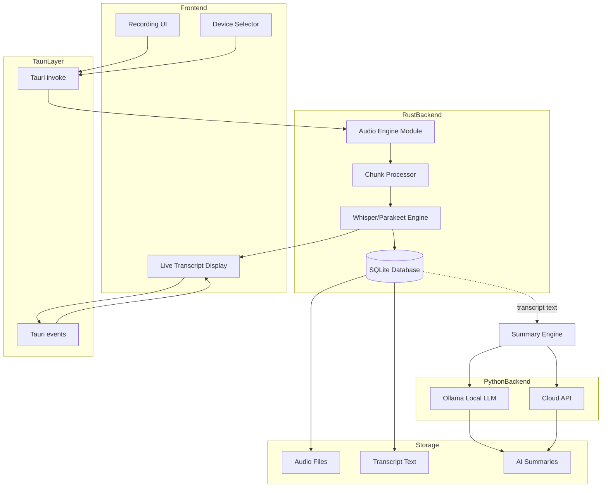
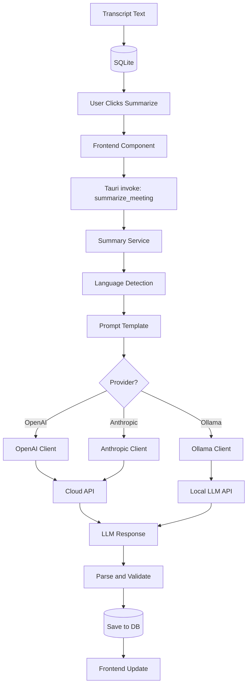
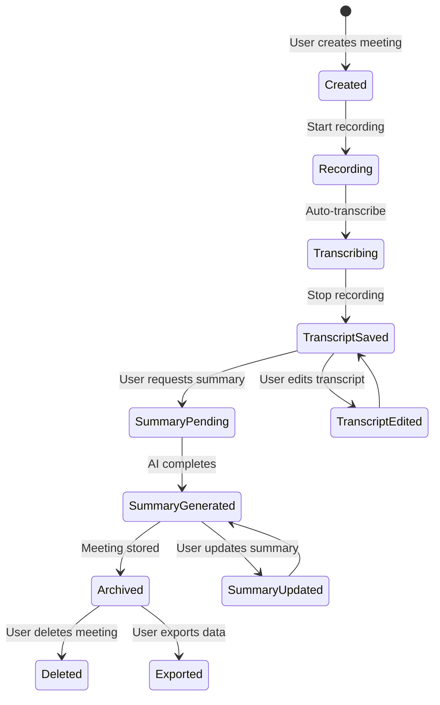
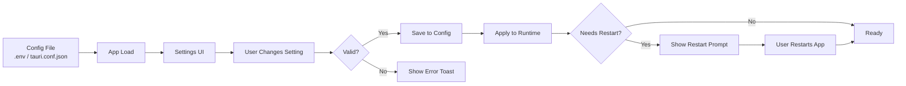
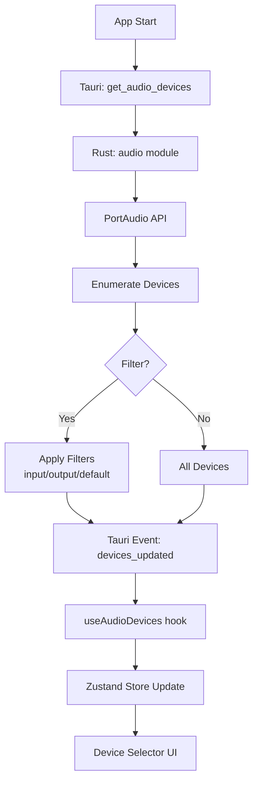

> Part of [Codebase Map](CODEBASE_MAP.md)

# Data Flow Diagrams

## Recording and Transcription Pipeline



### Flow Description

1. **User selects audio device** → Tauri invoke → Rust AudioEngine
2. **Recording starts** → AudioEngine captures audio stream → chunks sent to disk
3. **Chunks processed** → Whisper/Parakeet transcribes each chunk in real-time
4. **Transcript results** → Tauri event → Frontend LiveTranscript component updates
5. **Recording stops** → AudioEngine finalizes file → saved to Recordings

## Summary Generation Flow




## Meeting Data Lifecycle



## Configuration Flow




## Tauri Command Flow (Frontend to Backend)

```mermaid
graph TB
    subgraph ReactUI
        Button[Button Click]
        Hook[Custom Hook]
        Store[Zustand Store]
    end
    
    subgraph IPCBridge
        Invoke[@tauri-apps/api invoke]
        RustCmd[Rust Tauri Command]
    end
    
    subgraph RustModule
        Handler[Command Handler]
        Logic[Business Logic]
        DB[(SQLite)]
    end
    
    Button --> Hook
    Hook --> Invoke
    Store --> Invoke
    Invoke --> RustCmd
    RustCmd --> Handler
    Handler --> Logic
    Logic --> DB
    Logic --> Response[Response Data]
    Response --> IPCBridge
    IPCBridge --> ReactUI
```


## Audio Device Discovery Flow



## Key Data Paths Summary

| Path | Direction | Technology | Purpose |
|------|-----------|------------|---------|
| Recording start/stop | Frontend → Backend | Tauri invoke | Control recording lifecycle |
| Live transcript | Backend → Frontend | Tauri event | Real-time transcription display |
| Meeting list | Backend → Frontend | Tauri invoke + SQL query | Display meetings in UI |
| Summary generation | Frontend → Backend → API | HTTP + Tauri | AI-powered summarization |
| Settings changes | Frontend → Config file | File write | Persist user preferences |
| Device enumeration | Backend → Frontend | Tauri event | Audio device selection |