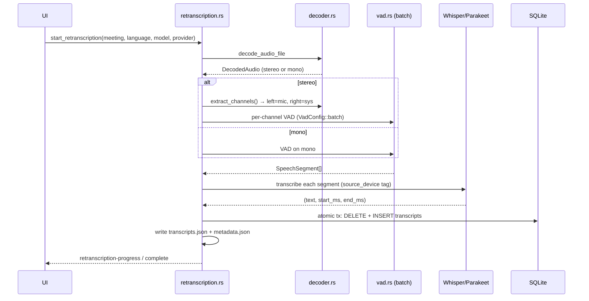
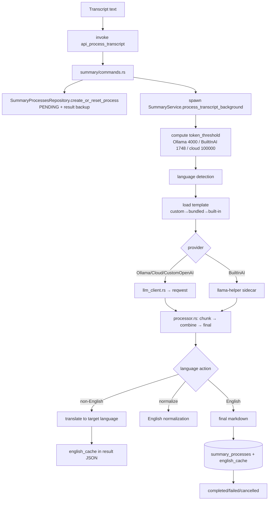
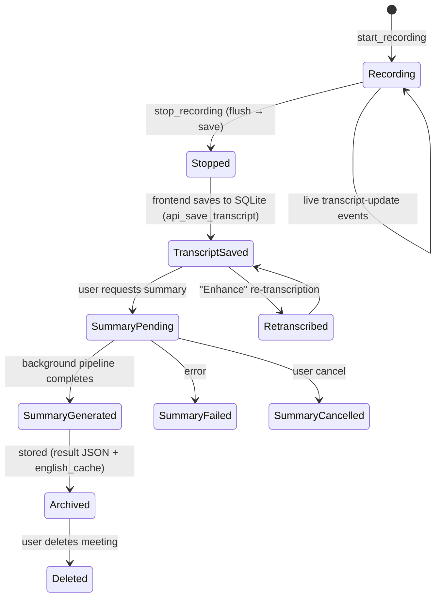
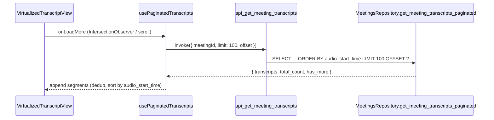

> Part of [Codebase Map](CODEBASE_MAP.md)

# Data Flow Diagrams

## Recording & Live Transcription Pipeline (mic + system channels)

```mermaid
graph TB
    subgraph Frontend
        Panel[Live TranscriptPanel]
        RecControls[RecordingControls]
        Page[Home page /]
    end

    subgraph RustAudio
        Mic[Microphone stream<br/>cpal]
        Sys[System stream<br/>CoreAudio/cpal]
        CapMic[AudioCapture MIC<br/>resample→48k + HPF/RNNoise/EBU]
        CapSys[AudioCapture SYS]
        State[RecordingState<br/>AudioChunk{device_type}]
        Ring[AudioMixerRingBuffer<br/>mic=left sys=right]
        VADm[ContinuousVadProcessor MIC]
        VADs[ContinuousVadProcessor SYS]
        Worker[transcription/worker.rs<br/>Whisper/Parakeet provider]
        RecSaver[RecordingSaver<br/>audio.mp4 stereo]
    end

    subgraph Tauri
        Cmd[start_recording_with_devices_and_meeting]
        Ev[transcript-update event]
    end

    RecControls --> Cmd
    Cmd --> Mic
    Cmd --> Sys
    Mic --> CapMic
    Sys --> CapSys
    CapMic --> State
    CapSys --> State
    State --> VADm
    State --> VADs
    State --> Ring
    VADm --> Worker
    VADs --> Worker
    Ring --> RecSaver
    Worker --> Ev
    Ev --> Panel
    Panel --> Page
```

1. `start_recording_with_devices_and_meeting` resolves mic (mandatory) + system (optional) devices and starts both streams.
2. Each stream's `AudioCapture` mono-izes, resamples to 48 kHz, and applies mic-only enhancement (HPF → RNNoise → EBU R128). Every `AudioChunk` carries a `device_type` (Microphone/System).
3. **Per-channel VAD** (`ContinuousVadProcessor`, Silero v6 + rolling buffer) filters speech on each channel and dispatches 16 kHz segments to the transcription worker.
4. **Recording path**: `AudioMixerRingBuffer` accumulates mic/system (600 ms windows) and `interleave_stereo` produces **left=mic, right=system** → `RecordingSaver` → `audio.mp4`.
5. Transcription results flow back as `transcript-update` events; `TranscriptContext` buffers/orders them with `sequence_id` and persists to IndexedDB for crash recovery.

## Re-transcription ("Enhance") Flow



## Summary Generation Flow



Every LLM call also writes a **debug log file** (`{folder}/{ts}_it_{n}.log`) via `summary/debug_log.rs` (working-tree addition).

## Meeting Data Lifecycle



> Note: DB save of transcripts is deliberately **deferred to the frontend** (after it has received all transcripts), unlike earlier designs.

## Paginated Transcript Loading (meeting details)



## Speaker Diarization Flow (offline + online)

```mermaid
graph TB
    subgraph Offline["Offline (diarization.rs)"]
        Trig[invoke start_diarization<br/>meeting_id + max_speakers] --> Dec[find_audio_file + decode_audio_file]
        Dec --> Split[extract_channels → mic=left / sys=right]
        Split --> PV[create_polyvoice_diarizer<br/>PowersetSegmenter + ResNet34Adapter + AHC]
        PV --> Run[per-channel: segment → embed → cluster]
        Run --> Match[compute_speaker_matches<br/>route by source_device + gap-fill]
        Match --> Persist[update_transcript_speaker +<br/>update_diarization_status]
        Persist --> Evt[diarization-progress events]
    end

    subgraph Online["Online (online_diarization.rs)"]
        Pipe[audio pipeline flush_pending_segments] --> Emb[embedding_sender channel]
        Emb --> Proc[OnlineDiarizationProcessor.process_chunk<br/>Efficient: buffer+cluster / Fast: StreamingPipeline]
        Proc --> Fin[finalize → SpeakerAssignment[]<br/>matched by sequence_id]
        Fin --> Stop[recording-stopped payload<br/>speaker_assignments]
        Stop --> FE[frontend applies speaker → saveMeeting]
    end

    Persist --> DB[(SQLite transcripts.speaker /<br/>meetings.diarization_status)]
    FE --> DB
    DB --> Label[update_speaker_label_command<br/>speaker_label + speaker_names JSON]
```

Label scheme: mic → `MIC_SPEAKER_NN`, system/mono → `SPEAKER_NN`; `speaker_label` is the user-assigned display name.

## Streaming Audio Player Flow

```mermaid
sequenceDiagram
    participant Panel as TranscriptPanel
    participant API as get_meeting_audio_path
    participant AP as AudioPlayer / useAudioPlayer
    participant FF as prepare_audio_for_playback

    Panel->>API: invoke get_meeting_audio_path(meetingId)
    API-->>Panel: file path (registered in asset protocol scope)
    Panel->>AP: audioPath
    AP->>AP: el.src = convertFileSrc(path); load()
    alt native decode fails
        AP->>FF: invoke prepare_audio_for_playback(filePath)
        FF-->>AP: transcoded 44.1kHz WAV (temp cache)
        AP->>AP: reload WAV
    end
    AP-->>Panel: currentTime → binary-search activeSegmentId → highlight + auto-scroll
```

## Key Data Paths Summary

| Path | Direction | Technology | Purpose |
|------|-----------|------------|---------|
| Recording start/stop | Frontend → Rust | Tauri invoke | Control recording lifecycle (mic + system) |
| Live transcript | Rust → Frontend | `transcript-update` event | Real-time per-channel transcript display |
| Persisted transcript pages | Frontend → Rust | `api_get_meeting_transcripts` | Infinite scroll on meeting-details page |
| Summary generation | Frontend → Rust → LLM | `api_process_transcript` + HTTP/sidecar | AI summarization |
| Re-transcription ("Enhance") | Frontend → Rust | `start_retranscription` | Re-process stored audio with new settings |
| Audio import | Frontend → Rust | `start_import_audio` | Import external audio as meetings |
| Speaker diarization (offline) | Frontend → Rust | `start_diarization` + `diarization-progress` events | Label speakers on stored audio |
| Speaker diarization (online) | Rust → Frontend | `recording-stopped` `speaker_assignments` | Label speakers during recording |
| Audio playback | Frontend → Rust | `get_meeting_audio_path`, `prepare_audio_for_playback` | Stream meeting recording |
| Settings/API keys | Frontend → Rust → SQLite | `api_save_model_config`, `api_save_transcript_config` | Persist config |
