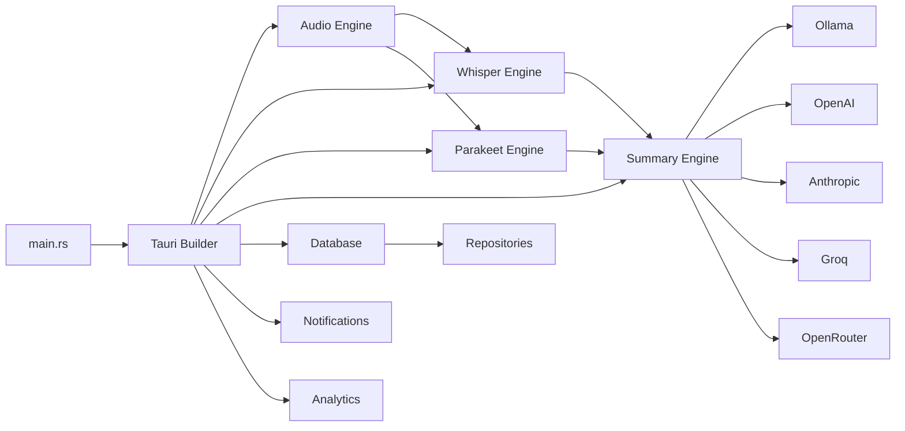

> Part of [Codebase Map](CODEBASE_MAP.md) | [Architecture](CODEBASE_MAP_ARCHITECTURE.md)

# Module Guide

## Module Dependency Overview



## Module Index

| Module | File | Purpose | Key Classes/Functions | Tokens |
|--------|------|---------|----------------------|--------|
| Audio Engine | [CODEBASE_MAP_MODULE_AUDIO.md](CODEBASE_MAP_MODULE_AUDIO.md) | Microphone + system audio capture, mixing, VAD, noise suppression | RecordingManager, Pipeline | ~80k |
| Whisper Engine | [CODEBASE_MAP_MODULE_WHISPER.md](CODEBASE_MAP_MODULE_WHISPER.md) | Whisper.cpp integration for speech-to-text with GPU acceleration | WhisperEngine, ParallelProcessor | ~45k |
| Parakeet Engine | [CODEBASE_MAP_MODULE_PARAKEET.md](CODEBASE_MAP_MODULE_PARAKEET.md) | ONNX-based Parakeet model for real-time transcription | ParakeetEngine, ModelManager | ~20k |
| Summary Engine | [CODEBASE_MAP_MODULE_SUMMARY.md](CODEBASE_MAP_MODULE_SUMMARY.md) | AI meeting summarization with multiple LLM providers | SummaryService, Processor, TemplateSystem | ~50k |
| Database Layer | [CODEBASE_MAP_MODULE_DATABASE.md](CODEBASE_MAP_MODULE_DATABASE.md) | SQLite storage for meetings, transcripts, summaries via sqlx | DBManager, Models, Repositories | ~35k |
| Notifications | [CODEBASE_MAP_MODULE_NOTIFICATIONS.md](CODEBASE_MAP_MODULE_NOTIFICATIONS.md) | System notifications with DND awareness and user preferences | NotificationManager, Settings | ~20k |
| Analytics | [CODEBASE_MAP_MODULE_ANALYTICS.md](CODEBASE_MAP_MODULE_ANALYTICS.md) | PostHog product analytics integration | AnalyticsTracker, Commands | ~15k |
| AI Providers | [CODEBASE_MAP_MODULE_AI_PROVIDERS.md](CODEBASE_MAP_MODULE_AI_PROVIDERS.md) | Ollama, OpenAI, Anthropic, Groq, OpenRouter integrations | Provider clients, API wrappers | ~30k |
| Frontend App | [CODEBASE_MAP_MODULE_FRONTEND_APP.md](CODEBASE_MAP_MODULE_FRONTEND_APP.md) | Next.js pages and application structure | Layouts, Pages | ~25k |
| Frontend Components | [CODEBASE_MAP_MODULE_FRONTEND_COMPONENTS.md](CODEBASE_MAP_MODULE_FRONTEND_COMPONENTS.md) | React UI components for meeting management | RecordingControls, TranscriptView, Settings | ~60k |

## Cross-Module Patterns

### Shared State Management Pattern
All modules that need shared state use `Arc<RwLock<T>>` pattern:
```rust
// Example from lib.rs line 415-417
.manage(Arc::new(RwLock::new(
    None::<notifications::manager::NotificationManager<tauri::Wry>>,
)) as NotificationManagerState<tauri::Wry>)
```

### Command Registration Pattern
All Tauri commands follow a consistent pattern:
```rust
#[tauri::command]
async fn command_name<R: Runtime>(app: AppHandle<R>, args: ArgsType) -> Result<ReturnType, String> {
    // Implementation
}
```

Registered in `lib.rs` `.invoke_handler(tauri::generate-handler![...])`.

### Logging Convention
- `log::info!()` for normal operations
- `log::error!()` for errors and failures
- `log::warn!()` for warnings
- Custom `perf_debug!` / `perf_trace!` macros in lib.rs for hot-path performance logging (disabled in release builds)

### Async Task Spawning Pattern
```rust
tauri::async_runtime::spawn(async {
    // Background task
});
```

## Module Communication

| From | To | Mechanism | Context |
|------|----|-----------|---------|
| Audio → Whisper/Parakeet | Transcription | Chunked audio files passed to engine | During recording, chunks sent every N seconds |
| Whisper/Parakeet → Summary | Transcript text | In-memory string passing | After transcription complete |
| Frontend → Rust Backend | Tauri invoke() | IPC command/response | Any frontend action triggering native operation |
| Database → All modules | Repository pattern | Dependency injection via AppState | Data persistence and retrieval |
| Notifications → System | OS API | Platform-specific notification APIs | Recording start/stop, errors, completions |

## Configuration Surface

All module configuration is centralized in:
- **Rust config.rs**: `config.rs` — Application-level settings (language preference, recording preferences)
- **Frontend config/api.ts**: API endpoint configuration
- **Environment variables**: Backend uses `.env` for API keys; frontend uses Next.js env
- **SQLite database**: Runtime configuration stored in app_data directory

## Platform-Specific Modules

| Module | macOS | Windows | Linux |
|--------|-------|---------|-------|
| Audio capture | CoreAudio (cidre) | WASAPI | PulseAudio/PipeWire |
| GPU acceleration | Metal + CoreML | CUDA/Vulkan | CUDA/Vulkan/ROCm |
| System tray | Yes (libayatana) | Yes (NotifyIcon) | Yes (libappindicator) |
| Notifications | NSUserNotificationCenter | Windows Toast | libnotify |