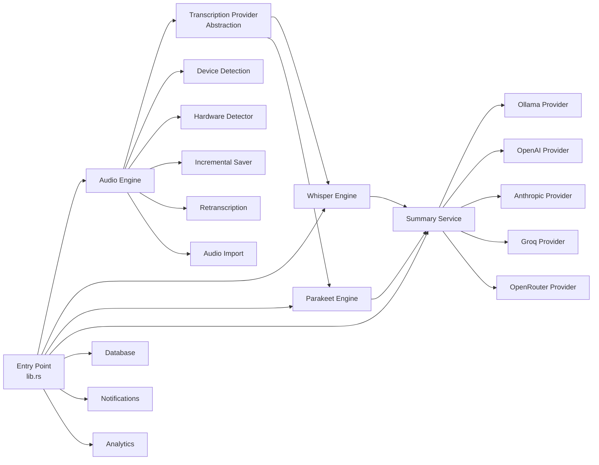

> Part of [Codebase Map](CODEBASE_MAP.md) | [Architecture](CODEBASE_MAP_ARCHITECTURE.md)

# Module Guide

## Module Dependency Overview



## Module Index

| Module | File | Purpose | Key Classes/Functions | Tokens |
|--------|------|---------|----------------------|--------|
| Entry Point | [CODEBASE_MAP_ARCHITECTURE.md](CODEBASE_MAP_ARCHITECTURE.md) | Tauri builder, commands, tray, onboarding | `run()`, `start_recording`, `tray.rs` | ~8k |
| Audio Engine | [CODEBASE_MAP_MODULE_AUDIO.md](CODEBASE_MAP_MODULE_AUDIO.md) | Capture, mixing, VAD, device management | `RecordingManager`, `AudioPipelineManager`, `VadProcessor` | ~120k |
| Whisper Engine | [CODEBASE_MAP_MODULE_WHISPER.md](CODEBASE_MAP_MODULE_WHISPER.md) | Whisper.cpp integration and model management | `WhisperEngine`, `ParallelProcessor` | ~30k |
| Parakeet Engine | [CODEBASE_MAP_MODULE_PARAKEET.md](CODEBASE_MAP_MODULE_PARAKEET.md) | ONNX streaming transcription | `ParakeetClient`, streaming inference | ~15k |
| Summary Service | [CODEBASE_MAP_MODULE_SUMMARY.md](CODEBASE_MAP_MODULE_SUMMARY.md) | AI summarization with multi-provider support | `SummaryService`, `Processor`, `LanguageDetection` | ~40k |
| AI Providers | [CODEBASE_MAP_MODULE_AI_PROVIDERS.md](CODEBASE_MAP_MODULE_AI_PROVIDERS.md) | Ollama, OpenAI, Anthropic, Groq, OpenRouter adapters | Provider clients, config structs | ~25k |
| Database | [CODEBASE_MAP_MODULE_DATABASE.md](CODEBASE_MAP_MODULE_DATABASE.md) | SQLite data layer and repositories | `DatabaseManager`, repository implementations | ~20k |
| Notifications | [CODEBASE_MAP_MODULE_NOTIFICATIONS.md](CODEBASE_MAP_MODULE_NOTIFICATIONS.md) | Desktop notification system | `NotificationManager`, DND awareness | ~8k |
| Analytics | [CODEBASE_MAP_MODULE_ANALYTICS.md](CODEBASE_MAP_MODULE_ANALYTICS.md) | PostHog integration | `Analytics` module, event tracking | ~5k |
| Frontend App | [CODEBASE_MAP_MODULE_FRONTEND_APP.md](CODEBASE_MAP_MODULE_FRONTEND_APP.md) | Next.js app shell and routing | Layouts, pages | ~20k |
| Frontend Components | [CODEBASE_MAP_MODULE_FRONTEND_COMPONENTS.md](CODEBASE_MAP_MODULE_FRONTEND_COMPONENTS.md) | UI component library | Shadcn + custom components | ~30k |
| Frontend Hooks | [CODEBASE_MAP_MODULE_FRONTEND_HOOKS.md](CODEBASE_MAP_MODULE_FRONTEND_HOOKS.md) | React hooks for state management | Recording, transcript, config hooks | ~15k |

## Cross-Module Patterns

### Command/Event Pattern (Tauri IPC)
- **Commands**: `#[tauri::command]` decorated async functions exposed to frontend via `invoke()`
- **Events**: `app.emit("event-name", payload)` pushes updates from Rust to React listeners
- **State Sharing**: `Arc<RwLock<T>>` and `Arc<AtomicBool>` for thread-safe shared state across async boundaries

### Audio Pipeline Pattern
```
Capture → Mixing → VAD → Transcription Provider → Summary Service
   ↓           ↓         ↓            ↓                  ↓
 Recording  Metrics  Whisper/     LLM API calls      SQLite storage
            (batch)  Parakeet
```

### Repository Pattern (Database)
- Abstract repository interfaces defined in `database/repositories/`
- Concrete implementations for SQLite via sqlx
- Meeting, transcript, summary, and template data models

### Provider Abstraction (Transcription & AI)
- Common interface for STT providers (Whisper, Parakeet, Ollama)
- Common interface for LLM summarization providers
- Engine lifecycle management (init → process → cleanup)

## Module Communication

| Sender | Receiver | Mechanism | Context |
|--------|----------|-----------|---------|
| Frontend | Rust (lib.rs) | Tauri `invoke()` command | Recording start/stop, transcription, DB queries |
| Rust audio pipeline | Rust whisper engine | Channel (`mpsc::UnboundedSender<AudioChunk>`) | Audio chunks for transcription |
| Rust whisper engine | Frontend | Tauri `app.emit("transcript-update")` | Real-time transcript segments |
| Summary service | Database | sqlx async queries | Store/generated summaries |
| Recording manager | Device monitor | mpsc channels | Device disconnect/reconnect events |
| Hardware detector | Whisper engine | Direct function call | Auto-select optimal model/config |

## Audio Engine Sub-Modules (Deep Dive)

### Core Recording Components

| File | Purpose | Key Exports | Tokens |
|------|---------|-------------|--------|
| `recording_manager.rs` | High-level recording orchestration | `RecordingManager::start_recording()`, `stop_recording()` | ~8k |
| `recording_state.rs` | Thread-safe recording state management | `RecordingState`, `AudioChunk`, `AudioError` | ~6k |
| `recording_commands.rs` | Tauri command interface for recording | `start_recording()`, `stop_recording()`, device events | ~10k |
| `recording_saver.rs` | Audio file and transcript writing | `RecordingSaver`, `TranscriptSegment` | ~5k |
| `recording_preferences.rs` | User preferences for recording settings | `RecordingPreferences`, backend selection | ~4k |
| `pipeline.rs` | Audio mixing pipeline with VAD | `AudioPipelineManager`, `AudioMixerRingBuffer` | ~8k |
| `stream.rs` | Audio stream creation and management | `AudioStreamManager`, platform-specific streams | ~5k |

### Device Management Components

| File | Purpose | Key Exports | Tokens |
|------|---------|-------------|--------|
| `devices/discovery.rs` | Cross-platform device enumeration | `list_audio_devices()`, `parse_audio_device()` | ~4k |
| `devices/microphone.rs` | Default microphone detection | `default_input_device()` | ~1k |
| `devices/speakers.rs` | Default speaker/output detection | `default_output_device()` | ~1k |
| `device_detection.rs` | Input device kind classification | `InputDeviceKind`, `calculate_buffer_timeout()` | ~3k |
| `device_monitor.rs` | Background device event monitoring | `AudioDeviceMonitor`, `DeviceEvent` | ~4k |
| `hardware_detector.rs` | Hardware profiling for Whisper config | `HardwareProfile`, `AdaptiveWhisperConfig` | ~5k |

### Audio Processing Components

| File | Purpose | Key Exports | Tokens |
|------|---------|-------------|--------|
| `audio_processing.rs` | Normalization, noise suppression, filters | `normalize_v2()`, `spectral_subtraction()`, `HighPassFilter` | ~8k |
| `vad.rs` | Voice Activity Detection | `ContinuousVadProcessor`, `extract_speech_16k()` | ~6k |
| `decoder.rs` | Audio file decoding (ffmpeg fallback) | `decode_audio_file()`, `DecodedAudio` | ~5k |
| `post_processor.rs` | Transcript text cleanup | `PostProcessor`, `clean_repetitive_text()` | ~3k |

### Advanced Recording Components

| File | Purpose | Key Exports | Tokens |
|------|---------|-------------|--------|
| `incremental_saver.rs` | Checkpoint-based audio saving | `IncrementalAudioSaver`, crash recovery | ~4k |
| `retranscription.rs` | Re-process stored audio with new settings | `start_retranscription()`, `RetranscriptionProgress` | ~5k |
| `import.rs` | Import external audio files as meetings | `start_import()`, `AudioFileInfo` | ~6k |
| `buffer_pool.rs` | Memory-efficient buffer pooling | `AudioBufferPool`, `PooledBuffer` | ~3k |
| `batch_processor.rs` | Batch processing with metrics | `BatchProcessor`, `AudioMetricsBatcher` | ~3k |
| `async_logger.rs` | Async structured logging | `AsyncLogger`, `get_async_logger()` | ~2k |

### System Audio Components

| File | Purpose | Key Exports | Tokens |
|------|---------|-------------|--------|
| `system_detector.rs` | System audio state detection | `SystemAudioDetector`, platform-specific detectors | ~5k |
| `system_audio_commands.rs` | Tauri commands for system audio | `start_system_audio_capture_command()` | ~3k |
| `playback_monitor.rs` | Active output device detection | `get_active_audio_output()`, `AudioOutputInfo` | ~2k |