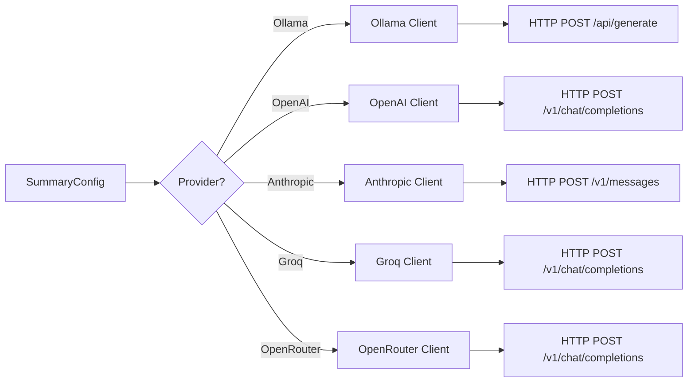

> Part of [Module Guide](CODEBASE_MAP_MODULES.md) | [Codebase Map](CODEBASE_MAP.md)

# Module: AI Providers

## Overview

**Purpose**: The AI providers module provides integration with multiple LLM services for meeting summarization. Each provider has its own client implementation handling authentication, API calls, response parsing, and error handling. Supports both cloud APIs (OpenAI, Anthropic, Groq, OpenRouter) and local models (Ollama).

**Entry point**: `summary/llm_client.rs` — generic LLM client trait
**Sub-packages**: `ollama/`, `openai/`, `anthropic/`, `groq/`, `openrouter/`

## File Reference per Provider

Each provider follows the same structure:

| File | Purpose | Key Exports | Tokens |
|------|---------|-------------|--------|
| `{provider}/mod.rs` | Module root | re-exports | ~0.5k |
| `{provider}.rs` | Provider API client | Client struct, send_request() | ~3-5k |
| `commands.rs` (some) | Tauri command handlers | provider_init, model_list | ~2k |

### Ollama (`ollama/`)

| File | Purpose | Key Exports | Tokens |
|------|---------|-------------|--------|
| `mod.rs` | Module root | re-exports | ~0.5k |
| `ollama.rs` | Ollama API client | OllamaClient, send_request(), list_models() | ~4k |
| `commands.rs` | Tauri commands | ollama_init, get_ollama_models, download_model | ~3k |
| `metadata.rs` | Model metadata | ModelMetadata struct | ~1k |

### OpenAI (`openai/`)

| File | Purpose | Key Exports | Tokens |
|------|---------|-------------|--------|
| `mod.rs` | Module root | re-exports | ~0.5k |
| `openai.rs` | OpenAI API client | OpenAIClient, send_request(), list_models() | ~4k |

### Anthropic (`anthropic/`)

| File | Purpose | Key Exports | Tokens |
|------|---------|-------------|--------|
| `mod.rs` | Module root | re-exports | ~0.5k |
| `anthropic.rs` | Anthropic API client | AnthropicClient, send_request() | ~4k |

### Groq (`groq/`)

| File | Purpose | Key Exports | Tokens |
|------|---------|-------------|--------|
| `mod.rs` | Module root | re-exports | ~0.5k |
| `groq.rs` | Groq API client | GroqClient, send_request() | ~3k |

### OpenRouter (`openrouter/`)

| File | Purpose | Key Exports | Tokens |
|------|---------|-------------|--------|
| `mod.rs` | Module root | re-exports | ~0.5k |
| `openrouter.rs` | OpenRouter API client | OpenRouterClient, send_request() | ~3k |
| `commands.rs` | Tauri commands | openrouter_init, get_models | ~2k |

## Public API (per provider)

### Common Trait Methods

```rust
trait LlmProvider {
    async fn send_request(&self, prompt: &str, system_prompt: &str) -> Result<String, ApiError>;
    async fn list_models(&self) -> Result<Vec<AvailableModel>, ApiError>;
    fn name(&self) -> &str;
}
```

### Provider-Specific Commands

| Provider | Key Commands | Description |
|----------|-------------|-------------|
| Ollama | `ollama_init`, `get_ollama_models`, `download_ollama_model` | Local model management |
| OpenAI | `openai_validate_key` | API key validation |
| Anthropic | `anthropic_validate_key` | API key validation |
| Groq | `groq_validate_key` | API key validation |
| OpenRouter | `openrouter_init`, `get_openrouter_models` | Model listing |

## Internal Architecture

### Provider Selection Flow




### Request/Response Pattern

Each provider implements the same request/response pattern:
1. Build JSON payload with system prompt + user message
2. Set provider-specific headers (Authorization, X-API-Key)
3. Send async HTTP POST via reqwest
4. Parse JSON response to extract text content
5. Return cleaned text or error

### Provider-Specific API Endpoints

| Provider | Endpoint | Auth Method |
|----------|----------|-------------|
| Ollama | `http://localhost:11434/api/generate` | Localhost (no auth) |
| OpenAI | `https://api.openai.com/v1/chat/completions` | Bearer token |
| Anthropic | `https://api.anthropic.com/v1/messages` | x-api-key header |
| Groq | `https://api.groq.com/openai/v1/chat/completions` | Bearer token |
| OpenRouter | `https://openrouter.ai/api/v1/chat/completions` | Bearer token |

## Dependencies (imports FROM)

| Module/Package | What is imported | Why |
|---------------|-----------------|-----|
| `reqwest` | Client, RequestBuilder | HTTP API calls |
| `serde` + `serde_json` | Deserialize responses | JSON response parsing |
| `summary/service.rs` | SummaryConfig | Provider selection configuration |

## Dependents (imported BY)

| Consumer Module | What it uses | Context |
|----------------|-------------|---------|
| `summary/processor.rs` | LlmProvider trait implementations | AI summarization of transcripts |
| `lib.rs` (main) | Tauri commands per provider | Frontend control of providers |

## Configuration

| Parameter | Default | Description |
|-----------|---------|-------------|
| `openai_api_key` | From env/config | OpenAI API key |
| `anthropic_api_key` | From env/config | Anthropic API key |
| `groq_api_key` | From env/config | Groq API key |
| `openrouter_api_key` | From env/config | OpenRouter API key |
| `ollama_base_url` | http://localhost:11434 | Ollama server URL |

## Error Handling

- **API key invalid**: Return specific error for UI to show "Invalid API key" message
- **Rate limit (429)**: Provider-specific retry-after header parsing
- **Model not found**: Return error with available model list
- **Network timeout**: Configurable timeout per provider (typically 60s)

## Gotchas and Tech Debt

- **Ollama dependency**: Requires Ollama server running locally; no auto-start mechanism
- **API key storage**: Keys stored in config file (not encrypted); consider secure storage
- **Response format inconsistency**: Each provider returns JSON differently — parsing must be provider-specific
- **No unified billing**: Cloud providers charge per token; no cost tracking across providers