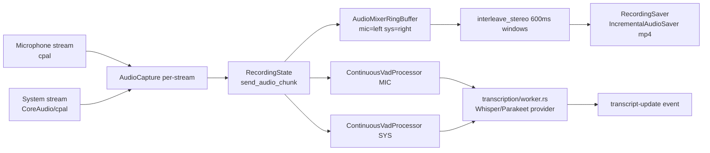

> Part of [Module Guide](CODEBASE_MAP_MODULES.md) | [Codebase Map](CODEBASE_MAP.md)

# Module: Audio Engine

## Overview

**Purpose**: The audio engine captures microphone + system-audio channels, applies per-channel Voice Activity Detection (VAD), mixes them into a stereo recording file, drives live transcription, and saves/imports/re-transcribes meetings. Recent major work introduced **mic/system channel separation** (recorded as stereo, left=mic / right=system), a **unified `VadConfig`** with a **rolling buffer for speech-onset recovery**, the **Silero VAD v6** model, a **transcription provider abstraction** (`transcription/` subpackage), and the **"Enhance" (re-transcription)** mode.

**Entry point**: `audio/mod.rs` — module root declaring all submodules and re-exporting the public API surface.

**Sub-packages**:
- `capture/` — Capture backends (cpal + macOS CoreAudio) and per-platform system-audio capture.
- `devices/` — Device enumeration/selection incl. platform-specific discovery (Windows/macOS/Linux).
- `transcription/` — **Provider abstraction** over Whisper/Parakeet engines + the live transcription worker.
- `devices/platform/` — Per-OS device implementation.

> **NOTE — two audio stacks:** `audio/` is the **active** module (declared `pub mod audio;` in `lib.rs:40`). `audio_v2/` (recorder/stream/mixer/normalizer/resampler/compatibility/sync/limiter) is **orphaned/experimental** — it is not declared in `lib.rs` and nothing imports it. Do not confuse the two.

## File Reference

| File | Purpose | Key Exports | Tokens |
|------|---------|-------------|--------|
| `mod.rs` | Module root, re-exports all submodules | recording_commands, AudioPipelineManager, etc. | ~1k |
| `common.rs` | Shared utils (crate-private): engine lifecycle lock, transcript segment builders, atomic JSON writes | `create_transcript_segments(_with_source)`, `write_transcripts_json`, `unload_engine_after_batch` | ~2k |
| `constants.rs` | Shared constants | `AUDIO_EXTENSIONS` | <1k |
| `stream.rs` | Capture stream wrapper + manager (mic CPAL, sys CoreAudio on macOS) | `AudioStream`, `AudioStreamManager`, `StreamBackend` | ~4k |
| `pipeline.rs` | **Core pipeline**: dual per-channel VAD + mic/sys stereo mixing | `AudioPipeline`, `AudioPipelineManager`, `AudioCapture`, `AudioMixerRingBuffer` | ~11k |
| `recording_manager.rs` | Facade wiring state/streams/pipeline/saver/monitor | `RecordingManager` | ~5k |
| `recording_commands.rs` | Tauri command layer for recording lifecycle | `start_recording`, `stop_recording`, `pause/resume`, `get_transcript_history` | ~9k |
| `recording_state.rs` | Thread-safe recording state machine + chunk/error types | `RecordingState`, `AudioChunk`, `AudioError`, `DeviceType` | ~4k |
| `recording_preferences.rs` | Recording prefs persistence (store plugin) + folder/backend helpers | `RecordingPreferences`, backend commands | ~3k |
| `recording_saver.rs` | Meeting folder/metadata/transcripts.json owner + final save | `RecordingSaver`, `TranscriptSegment`, `MeetingMetadata` | ~4k |
| `recording_saver_old.rs` | **Legacy** saver (unreferenced) | — | ~3k |
| `vad.rs` | **VAD engine (Silero v6)** — streaming + batch + unified config + rolling buffer | `ContinuousVadProcessor`, `VadSessionV6`, `VadConfig`, `get_speech_chunks*` | ~12k |
| `stt.rs` | **Legacy** speech-to-text orchestration (pre-provider-abstraction) | `stt`, `create_whisper_channel`, `run_stt` | ~3k |
| `retranscription.rs` | **"Enhance" / re-transcribe** mode (stereo channel split, cancellable) | `start_retranscription`, `RetranscriptionProgress` | ~10k |
| `import.rs` | Import external audio files as meetings | `start_import`, `AudioFileInfo`, validation | ~11k |
| `incremental_saver.rs` | Checkpoint-based incremental audio saving | `IncrementalAudioSaver` | ~4k |
| `decoder.rs` | Audio decode via Symphonia + FFmpeg fallback (MKV/WebM/WMA) | `decode_audio_file`, `DecodedAudio`, `normalize_audio_samples` | ~8k |
| `encode.rs` | Encode PCM → AAC/M4A via FFmpeg subprocess | `encode_single_audio`, `AudioInput` | <1k |
| `ffmpeg.rs` | FFmpeg discovery/auto-install | `find_ffmpeg_path` | ~2k |
| `ffmpeg_mixer.rs` | **Legacy/prototype** adaptive mixer (unused; real mixing in pipeline) | `FFmpegAudioMixer`, `RNNOISE_APPLY_ENABLED` | ~4k |
| `audio_processing.rs` | DSP: normalization, EBU R128 loudness, RNNoise, HPF, mono, resample, folder/file writers | `LoudnessNormalizer`, `NoiseSuppressionProcessor`, `HighPassFilter`, `resample_audio` | ~6k |
| `device_detection.rs` | Adaptive buffer sizing by `InputDeviceKind` | `InputDeviceKind`, `calculate_buffer_timeout` | ~4k |
| `device_monitor.rs` | Background device event monitoring | `AudioDeviceMonitor`, `DeviceEvent`, `DeviceMonitorType` | ~2k |
| `playback_monitor.rs` | Playback device monitoring | `AudioOutputInfo` | ~1k |
| `hardware_detector.rs` | Hardware/GPU capability detection | `HardwareProfile`, `GpuType`, `PerformanceTier` | ~3k |
| `system_detector.rs` | System audio detector | `SystemAudioDetector` | ~3k |
| `diagnostics.rs` | Device/buffer/perf diagnostics logging | `log_device_capabilities`, `log_performance_summary` | ~3k |
| `level_monitor.rs` | Real audio level monitoring (`audio-levels` events) | `AudioLevelMonitor` | ~2k |
| `simple_level_monitor.rs` | **Mock** level monitor (fake sinusoidal data) | `start_monitoring` | <1k |
| `buffer_pool.rs` | Buffer reuse pool | `AudioBufferPool`, `PooledBuffer` | ~1k |
| `batch_processor.rs` | Generic batching + audio metrics batching | `AudioMetricsBatcher`, `batch_audio_metric!` | ~1k |
| `async_logger.rs` | Non-blocking logging for audio threads | `AsyncLogger`, `async_info!` | ~1k |
| `post_processor.rs` | Post-recording processing | `PostProcessor` | ~2k |
| `permissions.rs` | macOS audio/screen-recording permissions | `check/request_screen_recording_permission` | ~1k |
| `core-old.rs` | **Legacy dead file** (not declared in mod.rs) | — | ~7k |
| `recording_commands.rs.backup` | **Stale backup** duplicate of recording_commands.rs | — | ~16k |
| `system_audio_types.ts` | **Orphaned TS file inside Rust tree** (no importers) | — | <1k |
| `capture/` | Capture backends: `core_audio.rs` (macOS), `system.rs`, `microphone.rs` (stub), `backend_config.rs` | `SystemAudioCapture`, `CoreAudioCapture`, `AudioCaptureBackend` | ~6k |
| `devices/` | `configuration.rs`, `discovery.rs`, `fallback.rs`, `microphone.rs`, `speakers.rs`, `platform/{windows,macos,linux}.rs` | `AudioDevice`, `list_audio_devices`, `default_input/output_device` | ~8k |
| `transcription/mod.rs` | Provider abstraction root | `start_transcription_task`, `TranscriptUpdate` | <1k |
| `transcription/engine.rs` | **Live transcription engine** (wires providers, reads transcript config) | `TranscriptionEngine` | ~3k |
| `transcription/provider.rs` | Provider trait/abstraction | `TranscriptProvider` trait | <1k |
| `transcription/worker.rs` | Live transcription worker (NUM_WORKERS=1) | `start_transcription_task` | ~5k |
| `transcription/whisper_provider.rs` | Whisper provider impl | `WhisperProvider` | <1k |
| `transcription/parakeet_provider.rs` | Parakeet provider impl | `ParakeetProvider` | <1k |

## Public API

### Key Functions (Tauri Commands)

| Function | Signature | Description |
|----------|-----------|-------------|
| `start_recording` | `(app) -> Result<(), String>` | Start recording with stored device prefs + default meeting name |
| `start_recording_with_meeting_name` | `(app, meeting_name: Option<String>) -> Result<(), String>` | Start recording with optional meeting name |
| `start_recording_with_devices_and_meeting` | `(app, mic, system, meeting) -> Result<(), String>` | Start recording with explicit mic/system device names |
| `stop_recording` | `(app, args: RecordingArgs) -> Result<(), String>` | Multi-stage graceful shutdown (flush, wait transcription, save) |
| `is_recording` / `is_recording_paused` | `() -> bool` | Recording/pause flag queries |
| `pause_recording` / `resume_recording` | `(app) -> Result<(), String>` | Pause/resume |
| `get_transcription_status` | `() -> TranscriptionStatus` | **Stubbed** (hardcoded zeros) |
| `get_recording_state` | `() -> serde_json::Value` | Durations/pause/active state |
| `get_transcript_history` | `() -> Result<Vec<TranscriptSegment>, String>` | Reload-sync history |
| `get_meeting_folder_path` / `get_recording_meeting_name` | `() -> Result<Option<String>, String>` | Current session metadata |
| `poll_audio_device_events` | `() -> Result<Option<DeviceEventResponse>, String>` | Frontend polls every 1–2s |
| `get_reconnection_status` / `attempt_device_reconnect` | `(device_name, device_type) -> Result<bool, String>` | Reconnection |
| `get_active_audio_output` | `() -> Result<AudioOutputInfo, String>` | Active output device |

### Key Types

```rust
enum DeviceType { Microphone, System }            // recording_state::DeviceType (aliased RecordingDeviceType)

struct AudioChunk {
    data: Vec<f32>, sample_rate: u32, timestamp: f64,
    chunk_id: u64, device_type: DeviceType, channels: u16,
}

struct TranscriptSegment {                          // recording_saver::TranscriptSegment
    id: String, text: String, audio_start_time: f64, audio_end_time: f64,
    duration: f64, display_time: String, confidence: f32,
    sequence_id: u64, source_device: String,        // "Microphone" | "System"
}

struct VadConfig {                                  // unified VAD config (vad.rs)
    threshold: f32, neg_threshold: f32, min_speech_ms: u32, redemption_ms: u32,
    pre_pad_ms: u32, post_pad_ms: u32, min_segment_samples: usize,
    max_segment_samples: Option<usize>, buffer_capacity: usize,  // rolling buffer
}
// presets: VadConfig::live() and VadConfig::batch()
```

## Internal Architecture

### Recording / Live Pipeline Flow



1. **Capture (`stream.rs`)**: mic always CPAL; system may use CoreAudio on macOS. Each stream has an `AudioCapture` that mono-izes, resamples to 48 kHz, and applies mic-only enhancement (HPF → RNNoise → EBU R128).
2. **State (`recording_state.rs`)**: every chunk carries `DeviceType` (Mic/System). Pause discards chunks; error thresholds (10 recoverable / 15 total) auto-stop.
3. **Dual VAD (`pipeline.rs` + `vad.rs`)**: one `ContinuousVadProcessor` per channel using `VadConfig::live()`. The **rolling buffer** (`audio_history`) prepends up to `pre_pad` samples on speech onset to recover the first ~150 ms that the onset transition would otherwise cut.
4. **Mixing (`pipeline.rs`)**: `AudioMixerRingBuffer` accumulates per-channel samples (600 ms window) and `interleave_stereo` produces **left=mic, right=system**; only the mixed stereo is sent to the recording file (raw per-channel goes to transcription — prevents echo, but transcript and file derive from different mixes).
5. **Transcription (`transcription/`)**: worker receives 16 kHz speech segments, dispatches via the provider abstraction to Whisper or Parakeet, emits `transcript-update` events.
6. **Saving (`recording_saver.rs` + `incremental_saver.rs`)**: writes `audio.mp4`, `transcripts.json`, `metadata.json` (atomic temp-file+rename). `stop_recording` does a 200 ms final-chunk sleep then `force_flush_and_stop`.

### Re-transcription ("Enhance") and Import

- `retranscription.rs` re-processes stored audio: decodes → if stereo, `extract_channels()` (left=mic, right=sys) → per-channel VAD (`VadConfig::batch`) → per-channel transcription with Whisper/Parakeet → atomic DB transaction replaces transcripts → rewrites `transcripts.json`/`metadata.json`. Cancellable via `RETRANSCRIPTION_CANCELLED`.
- `import.rs` imports external audio as a new meeting (validate → copy → decode → VAD → transcribe → DB), 20 GB size guard, beta-gated in the frontend.

### Concurrency Model

- Per-stream CPAL callbacks push chunks; tokio `mpsc::Unbounded` channels carry `AudioChunk`s to the pipeline task and the recorder accumulation task.
- `RecordingState` uses atomics + `Mutex`/`Arc`; `RecordingManager` uses manual `unsafe impl Send`.
- One transcription worker (`NUM_WORKERS=1`, serial) despite `"workers": 3` reported in a `recording-started` payload (cosmetic/stale).

## Dependencies (imports FROM)

| Module/Package | What is imported | Why |
|---------------|-----------------|-----|
| `whisper_engine` | `WHISPER_ENGINE`, `WhisperEngine` | Whisper transcription (engine + providers + retranscription/import) |
| `parakeet_engine` | `PARAKEET_ENGINE`, `ParakeetEngine` | Parakeet transcription |
| `api::api` | `api_get_transcript_config`, `api_get_model_config`, `TranscriptSegment` | Config + DTOs |
| `analytics` | `track_meeting_ended` | Recording analytics |
| `tray` | `update_tray_menu` | Tray icon state |
| `database` | Repositories (via api layer / retranscription) | Persist transcripts |

## Dependents (imported BY)

| Consumer Module | What it uses | Context |
|----------------|-------------|---------|
| `lib.rs` | All recording commands + `recording_saver::TranscriptSegment` | Command registration, DB save deferred to frontend |
| `tray.rs` | stop/pause/resume/is_recording | Tray menu actions |
| `summary/` | Transcript data | Summarization consumes recorded transcripts |

## Configuration

| Parameter | Default | Description |
|-----------|---------|-------------|
| `VadConfig::live()` | threshold 0.50, neg 0.35, min_speech 250ms, redemption 200ms, pre/post pad 150ms, buffer 5120 samples | Live streaming VAD |
| `VadConfig::batch()` | same + `max_segment_samples = Some(25*16000)` | Batch VAD for import/retranscription |
| VAD model | `models/silero_vad_v6.onnx` (embedded at compile time) | Requires 16 kHz input |
| Sample rates | capture→48 kHz; VAD/transcription→16 kHz | Pipeline resampling |
| `RecordingPreferences` | `save_folder`, `auto_save=true`, `file_format="mp4"`, preferred mic/system devices | Store key `"preferences"` |
| Merger | live gap 500ms / batch gap 2000ms; min segment 1600 samples | Segment merging |

## Error Handling

- `AudioError` enum: `DeviceDisconnected`, `StreamFailed`, `ProcessingFailed`, `TranscriptionFailed`, `ChannelClosed`, `InitializationFailed`, `ConfigurationError`, `PermissionDenied`, `BufferOverflow`, `SampleRateUnsupported`. `is_recoverable()` and `user_message()`.
- Mic failure is fatal (`Err`); system-audio failure is non-fatal (warn + continue).
- `stop_recording` is deliberately resilient: transcription wait/unload/save failures only warn.
- Shutdown uses flush signals (`chunk_id >= u64::MAX - 10`) to eliminate 30+ s shutdown delays.

## Concurrency and Thread Safety

- Atomics + `Mutex`/`Arc` in `RecordingState`; manual `unsafe impl Send` on streams/manager.
- `AudioBufferPool` (std `Mutex` deque) — not used on the CPAL hot path.
- `AsyncLogger` + `AudioMetricsBatcher` offload logging/metrics from the audio thread.
- System-buffer overflow in the mixer is `error!`-level (signals distortion).

## Gotchas and Tech Debt

- **Two audio stacks**: `audio_v2/` is fully dead/orphaned; keep it out of the active flow.
- **Stereo convention: left=mic, right=system** — critical; retranscription `extract_channels` and `interleave_stereo` must agree.
- **Rolling buffer**: added for speech-onset recovery; populated post-resampling (16 kHz units).
- **`AudioMixerRingBuffer` window is 600 ms** in code but comments say 50 ms/400 ms — significant doc/code drift.
- **RNNoise length mismatch**: `NoiseSuppressionProcessor::process` output is frame-aligned (not equal length), driving warnings in `pipeline.rs`.
- **`FFmpegAudioMixer` is unused** legacy; real mixing is in `pipeline.rs`. `RNNOISE_APPLY_ENABLED` const oddly lives there.
- **Dead/legacy files**: `core-old.rs`, `recording_saver_old.rs`, `stt.rs`, `recording_commands.rs.backup` (~16k tokens), `simple_level_monitor.rs` (mock), `capture/microphone.rs` (stub), orphaned `system_audio_types.ts`.
- **`get_transcription_status()` is a stub**; `"workers": 3` in `recording-started` is cosmetic (actually 1).
- **`panic!` on VAD init failure** and on encode spawn — harsh for a production recorder.
- **`unsafe` static `SAMPLE_COUNTER`** in `add_samples` for periodic logging (benign data race).
- **`permissions.rs`**: `check_screen_recording_permission` always returns `true` (misleading); string-matching used to detect denial.
- VAD requires exactly 16 kHz; non-16k inputs resampled. Timestamps always in 16k sample units.
