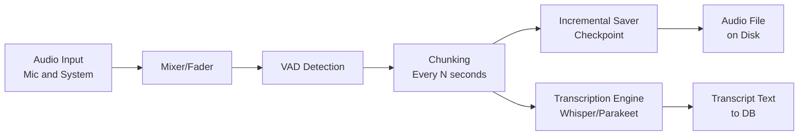

> Part of [Module Guide](CODEBASE_MAP_MODULES.md) | [Codebase Map](CODEBASE_MAP.md)

# Module: Audio Engine

## Overview

**Purpose**: The audio engine module handles all aspects of meeting audio capture — from microphone and system audio input through mixing, processing, transcription chunking, and file saving. It supports multi-device recording (mic + system simultaneously), real-time noise suppression, voice activity detection (VAD), and incremental checkpoint saving for crash recovery.

**Entry point**: `audio/mod.rs` — module root that re-exports all sub-modules
**Sub-packages**:
- `capture/` — Audio capture abstractions and device selection
- `devices/` — Platform-specific audio device enumeration and management
- `transcription/` — Integration with Whisper/Parakeet transcription engines
- `audio_v2/` — Next-gen audio processing pipeline (mixer, normalizer, resampler)

## File Reference

| File | Purpose | Key Exports | Tokens |
|------|---------|-------------|--------|
| `mod.rs` | Module root, re-exports all sub-modules | recording_commands, stream, pipeline, vad, etc. | ~2k |
| `stream.rs` | Core audio streaming and capture | AudioStream, StreamConfig | ~8k |
| `pipeline.rs` | Recording processing pipeline | Pipeline struct, chunking logic | ~10k |
| `recording_manager.rs` | Manages recording lifecycle | RecordingManager, start/stop/pause/resume | ~12k |
| `recording_commands.rs` | Tauri command handlers for recording | start_recording, stop_recording, pause_recording | ~8k |
| `recording_state.rs` | Recording state management | State enum, transitions | ~5k |
| `recording_preferences.rs` | User recording preferences | Preferences struct, save/load | ~6k |
| `stream.rs` | Audio stream abstraction | StreamConfig, device selection | ~8k |
| `capture/mod.rs` | Capture module root | CaptureDevice, CaptureStream | ~3k |
| `devices/mod.rs` | Device enumeration | list_devices, select_device | ~4k |
| `transcription/mod.rs` | Transcription integration | transcribe_chunk() | ~2k |
| `vad.rs` | Voice Activity Detection | VAD state machine, energy thresholds | ~8k |
| `buffer_pool.rs` | Audio buffer pooling for performance | BufferPool, reusable buffers | ~4k |
| `batch_processor.rs` | Batch processing of audio chunks | BatchProcessor, parallel processing | ~5k |
| `audio_processing.rs` | Audio signal processing utilities | Resample, normalize, mix | ~6k |
| `decoder.rs` | Audio format decoding (WAV/MP3) | decode_audio() | ~4k |
| `encode.rs` | Audio encoding to output formats | encode_to_wav(), encode_to_mp3() | ~5k |
| `ffmpeg.rs` | FFmpeg integration for audio processing | FFmpeg wrapper, codec handling | ~6k |
| `ffmpeg_mixer.rs` | Multi-track audio mixing via FFmpeg | mix_tracks() | ~4k |
| `incremental_saver.rs` | Checkpoint-based incremental file saving | save_checkpoint(), recover_from_checkpoints() | ~5k |
| `post_processor.rs` | Post-recording processing (format conversion) | post_process_recording() | ~3k |
| `level_monitor.rs` | Audio level metering for UI | start_monitoring(), get_levels() | ~4k |
| `simple_level_monitor.rs` | Simplified audio level monitoring | start_monitoring(), stop_monitoring() | ~2k |
| `device_detection.rs` | Dynamic device detection and changes | detect_device_changes() | ~3k |
| `device_monitor.rs` | Background device monitoring | DeviceMonitor, event handling | ~4k |
| `system_audio_stream.rs` | System audio capture (OS-specific) | SystemAudioStream | ~5k |
| `system_audio_commands.rs` | Tauri commands for system audio | start_system_capture(), list_system_devices() | ~3k |
| `permissions.rs` | macOS screen recording / audio permissions | check_permission(), request_permission() | ~4k |
| `hardware_detector.rs` | Hardware capability detection | detect_hardware(), GPU detection | ~2k |
| `system_detector.rs` | System type detection (macOS/Windows/Linux) | detect_system_type() | ~1k |
| `playback_monitor.rs` | Monitor playback device changes | PlaybackMonitor, disconnect events | ~3k |
| `async_logger.rs` | Async file logging during recording | AsyncLogger, log_chunk() | ~2k |
| `constants.rs` | Audio module constants | Sample rates, buffer sizes | ~1k |
| `common.rs` | Shared types and utilities | Common enums, helper functions | ~2k |
| `diagnostics.rs` | Recording diagnostics and debugging | diagnose_issues(), health checks | ~3k |
| `import.rs` | Import external audio files | import_audio(), validate_file() | ~4k |
| `retranscription.rs` | Retranscribe existing recordings | retranscribe_recording() | ~3k |
| `audio_v2/lib.rs` | Next-gen audio processing pipeline | V2Pipeline, new architecture | ~5k |
| `audio_v2/mixer.rs` | Multi-track mixing in v2 | Mixer, track management | ~3k |
| `audio_v2/normalizer.rs` | Audio normalization (gain, loudness) | Normalizer, level adjustment | ~2k |
| `audio_v2/resampler.rs` | Sample rate conversion | Resampler, format conversion | ~2k |
| `audio_v2/recorder.rs` | Recording implementation in v2 | Recorder, capture loop | ~3k |
| `audio_v2/stream.rs` | Streaming interface in v2 | Stream, data pipeline | ~2k |

## Public API

### Key Functions (Tauri Commands)

| Function | Signature | Description |
|----------|-----------|-------------|
| `start_recording` | `(app, mic_device?, system_device?, meeting_name?) -> Result<(), String>` | Start audio recording with optional device selection and meeting name |
| `stop_recording` | `(app, args: RecordingArgs) -> Result<(), String>` | Stop recording and save to file |
| `is_recording` | `() -> bool` | Check if currently recording |
| `pause_recording` | `(app) -> Result<(), String>` | Pause recording (preserves state) |
| `resume_recording` | `(app) -> Result<(), String>` | Resume paused recording |
| `is_recording_paused` | `() -> bool` | Check if recording is paused |
| `get_audio_devices` | `() -> Result<Vec<AudioDevice>, String>` | List all available audio input devices |
| `start_audio_level_monitoring` | `(app, device_names) -> Result<(), String>` | Start monitoring audio levels for UI meters |
| `stop_audio_level_monitoring` | `() -> Result<(), String>` | Stop level monitoring |
| `get_transcript_history` | `() -> Vec<TranscriptEntry>` | Retrieve saved transcript history from DB |
| `get_recording_meeting_name` | `() -> Option<String>` | Get current recording's meeting name |
| `recover_audio_from_checkpoints` | `(meeting_path) -> Result<PathBuf, String>` | Recover audio data from incremental checkpoints after crash |
| `poll_audio_device_events` | `() -> Vec<DeviceEvent>` | Poll for device connection/disconnection events |

### Key Types

```rust
struct AudioDevice {
    name: String,
    is_default: bool,
    device_type: DeviceType,  // Microphone | System
}

enum RecordingState {
    Idle,
    Recording,
    Paused,
    Stopping,
}

struct RecordingPreferences {
    audio_backend: AudioBackend,
    recordings_folder: PathBuf,
    format: AudioFormat,
    sample_rate: u32,
    bit_depth: u16,
    mic_device: Option<String>,
    system_device: Option<String>,
}
```

## Internal Architecture

### Recording Pipeline Flow




1. **Capture Layer**: `stream.rs` + `capture/` — Opens audio devices via platform-specific backends (cpal)
2. **Processing Layer**: `audio_processing.rs` + `audio_v2/` — Mixes multiple tracks, normalizes levels, applies noise suppression
3. **VAD Layer**: `vad.rs` — Detects speech segments to reduce transcription cost
4. **Chunking Layer**: `pipeline.rs` — Splits continuous audio into chunks for transcription
5. **Saving Layer**: `incremental_saver.rs` — Periodically flushes audio data to disk with checkpoints
6. **Transcription Layer**: `transcription/` — Sends chunks to Whisper or Parakeet engines

### Concurrency Model

- Audio capture runs in a dedicated tokio task
- VAD processing uses energy threshold comparison on buffered samples
- Chunking and transcription happen in parallel via rayon thread pool
- Incremental saving uses async file I/O with checkpoint metadata
- Device monitoring runs as a background tokio task polling for events

## Dependencies (imports FROM)

| Module/Package | What is imported | Why |
|---------------|-----------------|-----|
| `whisper_engine` | `WhisperEngine`, `parakeet_engine::ParakeetEngine` | Transcription of audio chunks |
| `database` | `DBManager`, repository types | Save transcripts to SQLite |
| `notifications` | `show_recording_started_notification()` | Notify user when recording starts |
| `state` | `AppState` | Shared application state access |

## Dependents (imported BY)

| Consumer Module | What it uses | Context |
|----------------|-------------|---------|
| `lib.rs` (main) | All Tauri commands, recording functions | Entry point for audio control from frontend |
| `summary/` | Transcript data from recordings | AI summarization uses recorded transcripts |

## Configuration

| Parameter | Default | Description |
|-----------|---------|-------------|
| `audio_backend` | Platform default | cpal (cross-platform), coreaudio (macOS) |
| `sample_rate` | 16000 Hz | Standard for speech recognition |
| `chunk_duration_sec` | 10 seconds | Duration of each transcription chunk |
| `checkpoint_interval_sec` | 30 seconds | How often to save incremental checkpoints |
| `vad_threshold` | 0.5 (energy-based) | Voice activity detection sensitivity |
| `recordings_folder` | User's Documents/Meetily | Default output directory for recordings |

## Error Handling

- **Custom errors**: Format-specific decode errors, device unavailable errors
- **Recovery**: Checkpoint-based audio recovery after crashes (`recover_audio_from_checkpoints`)
- **Logging**: All recording events logged at info level; errors at error level
- **Graceful degradation**: If system audio capture fails, falls back to microphone-only

## Concurrency and Thread Safety

- `Arc<RwLock<RecordingState>>` for shared mutable state across tasks
- Rayon thread pool for parallel chunk processing
- Tokio channels for device event communication
- Atomic flags (`AtomicBool`) for recording pause/resume state
- Lock-free buffer pooling in `buffer_pool.rs`

## Gotchas and Tech Debt

- **Device reconnection**: Bluetooth AirPods disconnect/reconnect can cause recording gaps — handled by `device_monitor.rs` but edge cases exist
- **macOS screen recording permission**: Required for system audio on macOS; must be granted separately from microphone permission
- **FFmpeg dependency**: External FFmpeg binary required for some audio formats — must be bundled or installed
- **Checkpoint recovery**: Audio checkpoints are stored in a separate directory; cleanup needed periodically via `cleanup_checkpoints()`
- **VAD tuning**: Energy-based VAD may need per-environment calibration for noisy environments