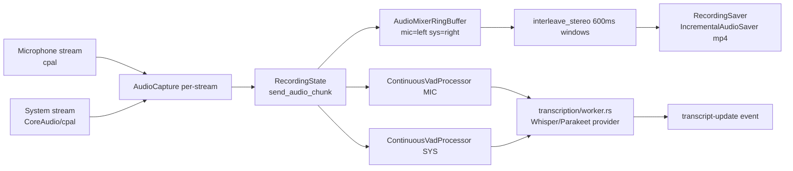

> Part of [Module Guide](CODEBASE_MAP_MODULES.md) | [Codebase Map](CODEBASE_MAP.md)

# Module: Audio Engine

## Overview

**Purpose**: The audio engine captures microphone + system-audio channels, applies per-channel Voice Activity Detection (VAD), mixes them into a stereo recording file, drives live transcription, and saves/imports/re-transcribes meetings. Recent major work introduced **mic/system channel separation** (recorded as stereo, left=mic / right=system), a **unified `VadConfig`** with a **rolling buffer for speech-onset recovery**, the **Silero VAD v6** model, a **transcription provider abstraction** (`transcription/` subpackage), the **"Enhance" (re-transcription)** mode, and — most recently — **speaker diarization** (offline `diarization.rs` + online `online_diarization.rs`, both using the **polyvoice** ONNX engine) plus a **streaming meeting audio player** (`audio_file.rs`).

**Entry point**: `audio/mod.rs` — module root declaring all submodules and re-exporting the public API surface.

**Sub-packages**:
- `capture/` — Capture backends (cpal + macOS CoreAudio) and per-platform system-audio capture.
- `devices/` — Device enumeration/selection incl. platform-specific discovery (Windows/macOS/Linux).
- `transcription/` — **Provider abstraction** over Whisper/Parakeet engines + the live transcription worker.
- `devices/platform/` — Per-OS device implementation.

> **NOTE — two audio stacks:** `audio/` is the **active** module (declared `pub mod audio;` in `lib.rs:40`). `audio_v2/` (recorder/stream/mixer/normalizer/resampler/compatibility/sync/limiter) is **orphaned/experimental** — it is not declared in `lib.rs` and nothing imports it. Do not confuse the two.

## File Reference

| File | Purpose | Key Exports | Tokens |
|------|---------|-------------|--------|
| `mod.rs` | Module root, re-exports all submodules | recording_commands, AudioPipelineManager, etc. | ~1k |
| `common.rs` | Shared utils (crate-private): engine lifecycle lock, transcript segment builders, atomic JSON writes | `create_transcript_segments(_with_source)`, `write_transcripts_json`, `unload_engine_after_batch` | ~2k |
| `constants.rs` | Shared constants | `AUDIO_EXTENSIONS` | <1k |
| `stream.rs` | Capture stream wrapper + manager (mic CPAL, sys CoreAudio on macOS) | `AudioStream`, `AudioStreamManager`, `StreamBackend` | ~4k |
| `pipeline.rs` | **Core pipeline**: dual per-channel VAD + mic/sys stereo mixing | `AudioPipeline`, `AudioPipelineManager`, `AudioCapture`, `AudioMixerRingBuffer` | ~11k |
| `recording_manager.rs` | Facade wiring state/streams/pipeline/saver/monitor | `RecordingManager` | ~5k |
| `recording_commands.rs` | Tauri command layer for recording lifecycle | `start_recording`, `stop_recording`, `pause/resume`, `get_transcript_history` | ~9k |
| `recording_state.rs` | Thread-safe recording state machine + chunk/error types | `RecordingState`, `AudioChunk`, `AudioError`, `DeviceType` | ~4k |
| `recording_preferences.rs` | Recording prefs persistence (store plugin) + folder/backend helpers | `RecordingPreferences`, backend commands | ~3k |
| `recording_saver.rs` | Meeting folder/metadata/transcripts.json owner + final save | `RecordingSaver`, `TranscriptSegment`, `MeetingMetadata` | ~4k |
| `recording_saver_old.rs` | **Legacy** saver (unreferenced) | — | ~3k |
| `vad.rs` | **VAD engine (Silero v6)** — streaming + batch + unified config + rolling buffer | `ContinuousVadProcessor`, `VadSessionV6`, `VadConfig`, `get_speech_chunks*` | ~12k |
| `stt.rs` | **Legacy** speech-to-text orchestration (pre-provider-abstraction) | `stt`, `create_whisper_channel`, `run_stt` | ~3k |
| `retranscription.rs` | **"Enhance" / re-transcribe** mode (stereo channel split, cancellable) | `start_retranscription`, `RetranscriptionProgress` | ~10k |
| `import.rs` | Import external audio files as meetings | `start_import`, `AudioFileInfo`, validation | ~11k |
| `incremental_saver.rs` | Checkpoint-based incremental audio saving | `IncrementalAudioSaver` | ~4k |
| `decoder.rs` | Audio decode via Symphonia + FFmpeg fallback (MKV/WebM/WMA) | `decode_audio_file`, `DecodedAudio`, `normalize_audio_samples` | ~8k |
| `encode.rs` | Encode PCM → AAC/M4A via FFmpeg subprocess | `encode_single_audio`, `AudioInput` | <1k |
| `ffmpeg.rs` | FFmpeg discovery/auto-install | `find_ffmpeg_path` | ~2k |
| `ffmpeg_mixer.rs` | **Legacy/prototype** adaptive mixer (unused; real mixing in pipeline) | `FFmpegAudioMixer`, `RNNOISE_APPLY_ENABLED` | ~4k |
| `audio_processing.rs` | DSP: normalization, EBU R128 loudness, RNNoise, HPF, mono, resample, folder/file writers | `LoudnessNormalizer`, `NoiseSuppressionProcessor`, `HighPassFilter`, `resample_audio` | ~6k |
| `device_detection.rs` | Adaptive buffer sizing by `InputDeviceKind` | `InputDeviceKind`, `calculate_buffer_timeout` | ~4k |
| `device_monitor.rs` | Background device event monitoring | `AudioDeviceMonitor`, `DeviceEvent`, `DeviceMonitorType` | ~2k |
| `playback_monitor.rs` | Playback device monitoring | `AudioOutputInfo` | ~1k |
| `hardware_detector.rs` | Hardware/GPU capability detection | `HardwareProfile`, `GpuType`, `PerformanceTier` | ~3k |
| `system_detector.rs` | System audio detector | `SystemAudioDetector` | ~3k |
| `diagnostics.rs` | Device/buffer/perf diagnostics logging | `log_device_capabilities`, `log_performance_summary` | ~3k |
| `level_monitor.rs` | Real audio level monitoring (`audio-levels` events) | `AudioLevelMonitor` | ~2k |
| `simple_level_monitor.rs` | **Mock** level monitor (fake sinusoidal data) | `start_monitoring` | <1k |
| `buffer_pool.rs` | Buffer reuse pool | `AudioBufferPool`, `PooledBuffer` | ~1k |
| `batch_processor.rs` | Generic batching + audio metrics batching | `AudioMetricsBatcher`, `batch_audio_metric!` | ~1k |
| `async_logger.rs` | Non-blocking logging for audio threads | `AsyncLogger`, `async_info!` | ~1k |
| `post_processor.rs` | Post-recording processing | `PostProcessor` | ~2k |
| `permissions.rs` | macOS audio/screen-recording permissions | `check/request_screen_recording_permission` | ~1k |
| `core-old.rs` | **Legacy dead file** (not declared in mod.rs) | — | ~7k |
| `recording_commands.rs.backup` | **Stale backup** duplicate of recording_commands.rs | — | ~16k |
| `system_audio_types.ts` | **Orphaned TS file inside Rust tree** (no importers) | — | <1k |
| `capture/` | Capture backends: `core_audio.rs` (macOS), `system.rs`, `microphone.rs` (stub), `backend_config.rs` | `SystemAudioCapture`, `CoreAudioCapture`, `AudioCaptureBackend` | ~6k |
| `devices/` | `configuration.rs`, `discovery.rs`, `fallback.rs`, `microphone.rs`, `speakers.rs`, `platform/{windows,macos,linux}.rs` | `AudioDevice`, `list_audio_devices`, `default_input/output_device` | ~8k |
| `transcription/mod.rs` | Provider abstraction root | `start_transcription_task`, `TranscriptUpdate` | <1k |
| `transcription/engine.rs` | **Live transcription engine** (wires providers, reads transcript config) | `TranscriptionEngine` | ~3k |
| `transcription/provider.rs` | Provider trait/abstraction | `TranscriptProvider` trait | <1k |
| `transcription/worker.rs` | Live transcription worker (NUM_WORKERS=1) | `start_transcription_task` | ~5k |
| `transcription/whisper_provider.rs` | Whisper provider impl | `WhisperProvider` | <1k |
| `transcription/parakeet_provider.rs` | Parakeet provider impl | `ParakeetProvider` | <1k |
| `transcription/commands.rs` | **NEW** model-readiness command (provider-aware gate) | `check_active_transcription_model_ready`, `TranscriptionModelStatus` | <1k |
| `diarization.rs` | **NEW** offline speaker diarization (polyvoice: powerset segmentation + ResNet34 embeddings + AHC clustering, per-channel) | `start_diarization`, `DiarizationResult`, `DiarizationProgress`, model check/download commands | ~7.6k |
| `online_diarization.rs` | **NEW** online (during-recording) diarization — Efficient (buffer+cluster) / Fast (polyvoice StreamingPipeline) modes | `OnlineDiarizationProcessor`, `DiarizationMode`, `SpeakerAssignment` | ~3.9k |
| `audio_file.rs` | **NEW** audio file discovery + FFmpeg transcode-to-WAV for webview playback (temp cache) | `find_audio_file`, `prepare_audio_for_playback` | <1k |

## Public API

### Key Functions (Tauri Commands)

| Function | Signature | Description |
|----------|-----------|-------------|
| `start_recording` | `(app) -> Result<(), String>` | Start recording with stored device prefs + default meeting name |
| `start_recording_with_meeting_name` | `(app, meeting_name: Option<String>) -> Result<(), String>` | Start recording with optional meeting name |
| `start_recording_with_devices_and_meeting` | `(app, mic, system, meeting) -> Result<(), String>` | Start recording with explicit mic/system device names |
| `stop_recording` | `(app, args: RecordingArgs) -> Result<(), String>` | Multi-stage graceful shutdown (flush, wait transcription, save) |
| `is_recording` / `is_recording_paused` | `() -> bool` | Recording/pause flag queries |
| `pause_recording` / `resume_recording` | `(app) -> Result<(), String>` | Pause/resume |
| `get_transcription_status` | `() -> TranscriptionStatus` | **Stubbed** (hardcoded zeros) |
| `get_recording_state` | `() -> serde_json::Value` | Durations/pause/active state |
| `get_transcript_history` | `() -> Result<Vec<TranscriptSegment>, String>` | Reload-sync history |
| `get_meeting_folder_path` / `get_recording_meeting_name` | `() -> Result<Option<String>, String>` | Current session metadata |
| `poll_audio_device_events` | `() -> Result<Option<DeviceEventResponse>, String>` | Frontend polls every 1–2s |
| `get_reconnection_status` / `attempt_device_reconnect` | `(device_name, device_type) -> Result<bool, String>` | Reconnection |
| `get_active_audio_output` | `() -> Result<AudioOutputInfo, String>` | Active output device |
| `start_diarization` | `(app, meeting_id: String, max_speakers: Option<i32>, state) -> Result<DiarizationResult, String>` | **Offline diarization**: decode audio → per-channel polyvoice → match speakers to transcripts → persist |
| `get_diarization_status` | `(app, meeting_id, state) -> Result<Value, String>` | `{ diarization_status, speaker_names }` for a meeting |
| `update_speaker_label_command` | `(app, meeting_id, speaker, label, state) -> Result<bool, String>` | Rename a speaker id to a user label |
| `check_diarization_models` / `download_diarization_models` | `(app) -> Result<DiarizationModelStatus, String>` / `(app) -> Result<(), String>` | Verify / download polyvoice ONNX models (segmentation + embedding) |
| `set_diarization_clustering_settings` | `(cluster_threshold: Option<f32>, cluster_ceiling: Option<usize>, gap_merge_secs: Option<f32>) -> Result<(), String>` | Mirror persisted offline-clustering overrides to the backend (None clears a key; `DiarizationConfig::resolved()` reads them) |
| `check_active_transcription_model_ready` | `(app) -> Result<TranscriptionModelStatus, String>` | **Provider-aware gate**: report `{ ready, provider, downloading }` for the active transcript provider |

### Key Types

```rust
enum DeviceType { Microphone, System }            // recording_state::DeviceType (aliased RecordingDeviceType)

struct AudioChunk {
    data: Vec<f32>, sample_rate: u32, timestamp: f64,
    chunk_id: u64, device_type: DeviceType, channels: u16,
}

struct TranscriptSegment {                          // recording_saver::TranscriptSegment
    id: String, text: String, audio_start_time: f64, audio_end_time: f64,
    duration: f64, display_time: String, confidence: f32,
    sequence_id: u64, source_device: String,        // "Microphone" | "System"
}

struct VadConfig {                                  // unified VAD config (vad.rs)
    threshold: f32, neg_threshold: f32, min_speech_ms: u32, redemption_ms: u32,
    pre_pad_ms: u32, post_pad_ms: u32, min_segment_samples: usize,
    max_segment_samples: Option<usize>, buffer_capacity: usize,  // rolling buffer
}
// presets: VadConfig::live() and VadConfig::batch()

enum DiarizationMode { Off, Efficient, Fast }     // online_diarization.rs; parse(Option<&str>)
struct SpeakerAssignment { sequence_id: u64, speaker: String }
struct DiarizationSegment { start: f32, end: f32, speaker: i32 }   // internal, seconds
// Label scheme (shared offline+online): mic → "MIC_SPEAKER_NN", system/mono → "SPEAKER_NN"

struct DiarizationConfig {                          // diarization.rs; default()/resolved()
    max_sessions: usize, chunk_overlap_secs: f32,
    cluster_threshold: f32,   // AHC min cosine merge; default 0.60 (TITANET_CLUSTER_THRESHOLD)
    cluster_ceiling: usize,   // hard speaker-count cap per channel; default 128 (DEFAULT_CLUSTER_CEILING)
    gap_merge_secs: f32,      // same-speaker gap-merge window; default 0.3 (DEFAULT_GAP_MERGE_SECS)
}
```

### Offline Clustering Settings Keys (persisted, optional)

Power-user overrides live in the browser settings store (localStorage,
`frontend/src/lib/diarization.ts`), are mirrored to the backend via
`set_diarization_clustering_settings` on startup, and are read by
`DiarizationConfig::resolved()`; unset keys fall back to the built-in
sweep-tuned defaults. Harness equivalents: `diarize-eval --cluster-threshold /
--max-clusters / --gap-merge` (see `eval/README.md`).

| localStorage key | Type | Built-in default | Effect |
| --- | --- | --- | --- |
| `diarizationClusterThreshold` | float | 0.60 | AHC merge criterion: minimum cosine similarity to merge two clusters. Lower → more merging, fewer speakers. |
| `diarizationClusterCeiling` | int | 128 | Hard cap on distinct speaker labels per channel per pass (always enforced; user `max_speakers` wins when smaller). |
| `diarizationGapMergeSecs` | float | 0.3 | Merge consecutive same-speaker output segments whose silence gap ≤ this window (0 = off; cross-speaker boundaries and overlaps untouched). |

## Internal Architecture

### Recording / Live Pipeline Flow



1. **Capture (`stream.rs`)**: mic always CPAL; system may use CoreAudio on macOS. Each stream has an `AudioCapture` that mono-izes, resamples to 48 kHz, and applies mic-only enhancement (HPF → RNNoise → EBU R128).
2. **State (`recording_state.rs`)**: every chunk carries `DeviceType` (Mic/System). Pause discards chunks; error thresholds (10 recoverable / 15 total) auto-stop.
3. **Dual VAD (`pipeline.rs` + `vad.rs`)**: one `ContinuousVadProcessor` per channel using `VadConfig::live()`. The **rolling buffer** (`audio_history`) prepends up to `pre_pad` samples on speech onset to recover the first ~150 ms that the onset transition would otherwise cut.
4. **Mixing (`pipeline.rs`)**: `AudioMixerRingBuffer` accumulates per-channel samples (600 ms window) and `interleave_stereo` produces **left=mic, right=system**; only the mixed stereo is sent to the recording file (raw per-channel goes to transcription — prevents echo, but transcript and file derive from different mixes).
5. **Transcription (`transcription/`)**: worker receives 16 kHz speech segments, dispatches via the provider abstraction to Whisper or Parakeet, emits `transcript-update` events.
6. **Saving (`recording_saver.rs` + `incremental_saver.rs`)**: writes `audio.mp4`, `transcripts.json`, `metadata.json` (atomic temp-file+rename). `stop_recording` does a 200 ms final-chunk sleep then `force_flush_and_stop`.

### Re-transcription ("Enhance") and Import

- `retranscription.rs` re-processes stored audio: decodes → if stereo, `extract_channels()` (left=mic, right=sys) → per-channel VAD (`VadConfig::batch`) → per-channel transcription with Whisper/Parakeet → atomic DB transaction replaces transcripts → rewrites `transcripts.json`/`metadata.json`. Cancellable via `RETRANSCRIPTION_CANCELLED`.
- `import.rs` imports external audio as a new meeting (validate → copy → decode → VAD → transcribe → DB), 20 GB size guard, beta-gated in the frontend. Import is **mono-only** (no `source_device`).

### Speaker Diarization (NEW)

**Offline (`diarization.rs`)** — `start_diarization` runs in `spawn_blocking`:
1. Load transcripts (`get_transcripts_for_diarization`), locate + decode the meeting audio.
2. `extract_channels()` splits stereo into mic (left) / system (right); mono is treated as remote-only.
3. `create_polyvoice_diarizer` loads `PowersetSegmenter` + `ResNet34Adapter` (256-dim, CPU) + `MinClusterSizeClusterer(AhcClusterer, 2)`; geometry overridden from the manifest to fix a polyvoice `window_size`→`window_secs` unit mismatch.
4. Per-channel: segment → embed → cluster → `DiarizationSegment[]`.
5. `compute_speaker_matches` routes each transcript by `source_device`, picks the segment with max temporal overlap (with 30s nearest-speaker **gap-fill** fallback), formats `MIC_SPEAKER_NN`/`SPEAKER_NN`.
6. Persists via `update_transcript_speaker` + `update_diarization_status`; streams `diarization-progress` events.

**Online (`online_diarization.rs`)** — during recording, driven by `recording_commands.rs`:
- The pipeline fans VAD-merged speech segments to an `embedding_sender` channel; a `spawn_blocking` consumer feeds `OnlineDiarizationProcessor::process_chunk`.
- **Efficient** mode buffers one ResNet34 embedding per segment per channel, clusters at stop. **Fast** mode runs polyvoice's `StreamingPipeline` (EnergyVAD + ResNet34) per channel, buffering stable turns and re-expanding pipeline time via a `TimelineMapper`.
- At stop, `finalize` clusters/translates and matches against in-memory `TranscriptSegment`s, returning `SpeakerAssignment[]` attached to the `recording-stopped` payload (`online_diarization_used`, `speaker_assignments`); the frontend applies them before saving.
- Guarded by `OnlineDiarizationGuard` (one recording at a time); model-init failure degrades to no diarization (`online-diarization-unavailable` event).

**Speaker identity registry (`speaker-identity-registry` change)** — the embeddings both paths compute are now persisted instead of discarded:

- New tables (migration `20260817000000_add_speaker_identity_registry.sql`): `speakers` (global person registry, case-insensitive unique names), `speaker_embeddings` (one table, two owners — enrolled prototype `speaker_id` or per-meeting cluster cache `meeting_id`+`cluster_label`, enforced by a CHECK), `meeting_speakers` (per-meeting cluster→person mapping + centroid + `matched_by`/'auto'/'user'), `meeting_expected_speakers` (recognition allowlist; empty = match all).
- `audio/speaker_recognition.rs`: brute-force cosine matching (`best_match`, τ=0.7, same-channel preference, `model` tag filter `resnet34-int8`).
- `database/repositories/speaker.rs`: find-or-create/rename speakers, `write_cluster_cache` (centroid + exemplar cache), enrollment by reparenting best-K=8 cache rows (per-person cap 64), prototype loading, expected-speaker set/get, storage stats.
- After clustering/stop, `persist_and_recognize_session` (offline `diarization.rs`) or `finalize_online_session` (online, called by the frontend after the meeting save) persists caches, auto-recognizes against expected/all prototypes, enrolls user-assigned clusters, and persists expected speakers. `rematch_meeting_speakers` re-runs recognition from cached centroids only (no audio), preserving `matched_by='user'`.
- New Tauri commands: `list_speakers`, `assign_speaker`, `rename_speaker`, `set_expected_speakers`, `get_expected_speakers`, `assign_live_speaker`, `rematch_meeting_speakers`, `finalize_online_session`, `speaker_storage_stats`.
- Live Fast mode: `PrototypeStore` (shared `Arc<RwLock>` beside `ONLINE_DIARIZATION_TASK`) matches each chunk embedding and relabels turns via `SpeakerTurn.display_name`; `assign_live_speaker` binds mid-recording renames that take effect immediately.

### Word-Level CTC Alignment (`word_alignment/`) (NEW — `word-level-diarization-alignment` change)

Post-ASR forced alignment that refines per-word timestamps so the token N-way
speaker split (`token_assignment.rs`) operates on word-true boundaries. Reuses
the existing `ort` runtime (no new heavy deps; `half` added for f16 tensor
extraction). All failure modes degrade silently to the ASR-provided tokens.

- **`catalog.rs`** — model catalog + readiness resolver. Default model
  `wav2vec2-xlsr-56` = `NewComer00/wav2vec2-xlsr-multilingual-56-ONNX`
  (56-language wav2vec2-large CTC), files under `app_data_dir/models/alignment/<id>/`
  (existence + min-size validation → `Available`/`Missing`/`Downloading`/`Corrupted`).
- **`download.rs`** — HF multi-file download with weighted progress, Range
  resume, cancel (partial cleanup), delete — cloned from the Parakeet pattern.
- **`engine.rs`** — `AlignmentEngine`: lazily-pooled ONNX sessions
  (`min(8, ceil(0.75×cores))`), per-span zero-mean/unit-variance normalize →
  `input_values` f32 → `logits` (f32 despite the fp16 file) → row log-softmax
  `[frames×9913]`, blank id from `config.pad_token_id`, 20 ms frame hop.
  `align_tokens` refines a segment's tokens in place; `align_tokens_with_timeout`
  bounds each segment on a helper thread.
- **`viterbi.rs`** — character-sequence builder (word-boundary + repeat blank
  markers; out-of-alphabet char → per-segment fallback, never an error) and a
  CTC blank-aware constrained interval-Viterbi recovering per-word frame ranges.
- **`refine.rs`** — `refine_segment_tokens(segments, source, settings)` (the
  single repair entry point) + `refine_tokens_with_source` core + `AudioSpanSource`
  (`FileSpanSource` ffmpeg `-ss/-t` bounded windows with per-channel batching,
  mic=left/system=right; `MemorySpanSource`). Skips already-`refined` segments.
- **`queue.rs`** — bounded live queue (128 MB, drop-oldest) + consumer.
- **`settings.rs`** — process globals for `wordAlignmentEnabled` (default on) +
  `alignmentModelId`, set by the `set_word_alignment_settings` command.

**Three call sites (single engine + one `refined` flag):**
1. **Live** (`transcription/worker.rs`): a final result with tokens moves its
   in-memory 16 kHz block into the queue; the consumer refines and **re-emits**
   `transcript-update` for the same `sequence_id` (the recording_commands
   listener upserts it into `SHARED_SEGMENTS`/`transcripts.json`). Partials are
   never queued. The task drains the queue (bounded wait) before returning so
   stop-time finalize sees refined-or-baseline data.
2. **Stop-time repair** (`recording_commands.rs` finalize path): refines
   segments still lacking refined tokens from the saved post-flush meeting file
   before `OnlineDiarizationProcessor::finalize`'s N-way expansion.
3. **Offline repair** (`diarization.rs`): `refine_offline_rows` refines stored
   rows' tokens per-channel from the meeting audio immediately before
   `assign_tokens_to_speakers`.

**Token plumbing fix (D6):** both `transcript-update` listeners now forward
`update.tokens` (was hardcoded `None`); `Token` gained a `refined` flag; the
Parakeet engine exposes native frame-aligned word timestamps via
`transcribe_audio_with_tokens` (worker populates `TranscriptUpdate.tokens` for
Parakeet exactly like Whisper). Frontend `Transcript`/`TranscriptUpdate` types +
save payload carry `tokens` (DB `transcripts.tokens` column already bound).

### Streaming Meeting Audio Player (`audio_file.rs`)

`find_audio_file` locates a meeting's recording (candidate name list → extension scan); `prepare_audio_for_playback` FFmpeg-transcodes to 44.1 kHz WAV in `%TEMP%/meetily-playback` (cached by `(path, mtime)` hash, atomic `.part`→rename). The webview streams via `convertFileSrc`; on native decode failure `useAudioPlayer` falls back to `prepare_audio_for_playback`.

### Concurrency Model

- Per-stream CPAL callbacks push chunks; tokio `mpsc::Unbounded` channels carry `AudioChunk`s to the pipeline task and the recorder accumulation task.
- `RecordingState` uses atomics + `Mutex`/`Arc`; `RecordingManager` uses manual `unsafe impl Send`.
- One transcription worker (`NUM_WORKERS=1`, serial) despite `"workers": 3` reported in a `recording-started` payload (cosmetic/stale).

## Dependencies (imports FROM)

| Module/Package | What is imported | Why |
|---------------|-----------------|-----|
| `whisper_engine` | `WHISPER_ENGINE`, `WhisperEngine` | Whisper transcription (engine + providers + retranscription/import) |
| `parakeet_engine` | `PARAKEET_ENGINE`, `ParakeetEngine` | Parakeet transcription |
| `api::api` | `api_get_transcript_config`, `api_get_model_config`, `TranscriptSegment` | Config + DTOs |
| `analytics` | `track_meeting_ended` | Recording analytics |
| `tray` | `update_tray_menu` | Tray icon state |
| `database` | Repositories (via api layer / retranscription / diarization) | Persist transcripts, speaker labels, diarization status |
| `polyvoice` (=0.17.0) | `PowersetSegmenter`, `ResNet34Adapter`, `AhcClusterer`, `streaming::StreamingPipeline` | Speaker diarization (segmentation + embedding + clustering) |

## Dependents (imported BY)

| Consumer Module | What it uses | Context |
|----------------|-------------|---------|
| `lib.rs` | All recording commands + diarization commands + `recording_saver::TranscriptSegment` | Command registration, DB save deferred to frontend |
| `tray.rs` | stop/pause/resume/is_recording + `check_active_transcription_model_ready` | Tray menu actions + model-readiness gating |
| `summary/` | Transcript data | Summarization consumes recorded transcripts |
| `api/api.rs` | `find_audio_file`, `prepare_audio_for_playback` | `get_meeting_audio_path` / `prepare_audio_for_playback` commands |

## Configuration

| Parameter | Default | Description |
|-----------|---------|-------------|
| `VadConfig::live()` | threshold 0.50, neg 0.35, min_speech 250ms, redemption 200ms, pre/post pad 150ms, buffer 5120 samples | Live streaming VAD |
| `VadConfig::batch()` | same + `max_segment_samples = Some(25*16000)` | Batch VAD for import/retranscription |
| VAD model | `models/silero_vad_v6.onnx` (embedded at compile time) | Requires 16 kHz input |
| Sample rates | capture→48 kHz; VAD/transcription→16 kHz | Pipeline resampling |
| `RecordingPreferences` | `save_folder`, `auto_save=true`, `file_format="mp4"`, preferred mic/system devices | Store key `"preferences"` |
| Merger | live gap 500ms / batch gap 2000ms; min segment 1600 samples | Segment merging |

## Error Handling

- `AudioError` enum: `DeviceDisconnected`, `StreamFailed`, `ProcessingFailed`, `TranscriptionFailed`, `ChannelClosed`, `InitializationFailed`, `ConfigurationError`, `PermissionDenied`, `BufferOverflow`, `SampleRateUnsupported`. `is_recoverable()` and `user_message()`.
- Mic failure is fatal (`Err`); system-audio failure is non-fatal (warn + continue).
- `stop_recording` is deliberately resilient: transcription wait/unload/save failures only warn.
- Shutdown uses flush signals (`chunk_id >= u64::MAX - 10`) to eliminate 30+ s shutdown delays.

## Concurrency and Thread Safety

- Atomics + `Mutex`/`Arc` in `RecordingState`; manual `unsafe impl Send` on streams/manager.
- `AudioBufferPool` (std `Mutex` deque) — not used on the CPAL hot path.
- `AsyncLogger` + `AudioMetricsBatcher` offload logging/metrics from the audio thread.
- System-buffer overflow in the mixer is `error!`-level (signals distortion).

## Gotchas and Tech Debt

- **Two audio stacks**: `audio_v2/` is fully dead/orphaned; keep it out of the active flow.
- **Stereo convention: left=mic, right=system** — critical; retranscription `extract_channels` and `interleave_stereo` must agree.
- **Rolling buffer**: added for speech-onset recovery; populated post-resampling (16 kHz units).
- **`AudioMixerRingBuffer` window is 600 ms** in code but comments say 50 ms/400 ms — significant doc/code drift.
- **RNNoise length mismatch**: `NoiseSuppressionProcessor::process` output is frame-aligned (not equal length), driving warnings in `pipeline.rs`.
- **`FFmpegAudioMixer` is unused** legacy; real mixing is in `pipeline.rs`. `RNNOISE_APPLY_ENABLED` const oddly lives there.
- **Dead/legacy files**: `core-old.rs`, `recording_saver_old.rs`, `stt.rs`, `recording_commands.rs.backup` (~16k tokens), `simple_level_monitor.rs` (mock), `capture/microphone.rs` (stub), orphaned `system_audio_types.ts`.
- **`get_transcription_status()` is a stub**; `"workers": 3` in `recording-started` is cosmetic (actually 1).
- **`panic!` on VAD init failure** and on encode spawn — harsh for a production recorder.
- **`unsafe` static `SAMPLE_COUNTER`** in `add_samples` for periodic logging (benign data race).
- **`permissions.rs`**: `check_screen_recording_permission` always returns `true` (misleading); string-matching used to detect denial.
- VAD requires exactly 16 kHz; non-16k inputs resampled. Timestamps always in 16k sample units.
- **Diarization is CPU-only** (embedder built with `1` intra-op thread, CPU provider) even though GPU build scripts exist for Whisper.
- **`DiarizationGuard`/`OnlineDiarizationGuard` are process-global** — one offline + one online diarization run at a time max.
- **polyvoice geometry unit mismatch** (ONNX `window_size` samples vs `window_secs` seconds) worked around by overriding geometry from the manifest in `create_polyvoice_diarizer`.
- **Offline `speakers_found` double-counts** a speaker present on both channels (label ids are channel-scoped, not cross-channel).
- **Online Fast mode labels** come from polyvoice's arrival-order cache, not AHC — may not be globally consistent; channel prefix keeps mic/system separate.
- **Efficient mode unbounded memory**: a full 256-dim embedding per speech segment is retained for the whole recording.
- **`audio_file.rs` playback cache is unbounded** (no TTL/size eviction) and keyed by `DefaultHasher` (a Rust toolchain upgrade can invalidate all cached WAVs).
