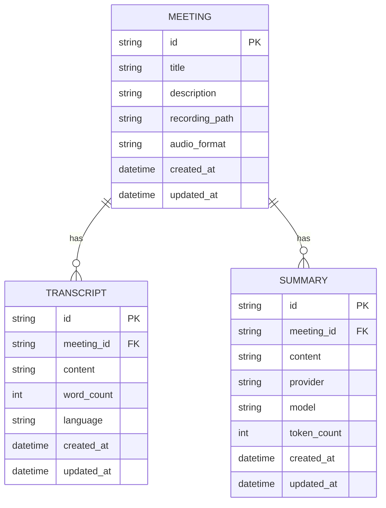

> Part of [Module Guide](CODEBASE_MAP_MODULES.md) | [Codebase Map](CODEBASE_MAP.md)

# Module: Database Layer

## Overview

**Purpose**: The database module provides SQLite-based persistent storage for all Meetily data — meetings, transcripts, summaries, recording metadata, and application settings. Built with sqlx for compile-time query checking and async operations via tokio runtime.

**Entry point**: `database/mod.rs` — module root
**Sub-packages**:
- `repositories/` — Repository pattern implementations for each entity type

## File Reference

| File | Purpose | Key Exports | Tokens |
|------|---------|-------------|--------|
| `mod.rs` | Module root, re-exports all sub-modules | database types | ~1k |
| `manager.rs` | Database connection management | DBManager struct, init/execute/query | ~8k |
| `models.rs` | SQL table definitions and Rust structs | Meeting, Transcript, Summary models | ~6k |
| `setup.rs` | Schema initialization and migrations | create_tables(), migrate_schema() | ~4k |
| `commands.rs` | Tauri command handlers for DB operations | get_meetings, save_transcript, etc. | ~8k |

### repositories/ sub-package

| File | Purpose | Key Exports | Tokens |
|------|---------|-------------|--------|
| `mod.rs` | Repository module root | re-exports | ~0.5k |
| `meeting_repository.rs` | Meeting CRUD operations | MeetingRepository, create/get/list/delete | ~6k |
| `transcript_repository.rs` | Transcript CRUD operations | TranscriptRepository, save/get_by_meeting() | ~5k |
| `summary_repository.rs` | Summary CRUD operations | SummaryRepository, save/get_by_meeting() | ~4k |

## Public API

### Key Functions (Tauri Commands)

| Function | Signature | Description |
|----------|-----------|-------------|
| `get_all_meetings` | `(page?, limit?) -> Result<Vec<MeetingEntry>, String>` | List meetings with pagination |
| `get_meeting_by_id` | `(meeting_id) -> Result<Option<Meeting>, String>` | Get single meeting by ID |
| `create_meeting` | `(title, description?, recording_path?) -> Result<String, String>` | Create new meeting entry |
| `update_meeting` | `(meeting_id, updates) -> Result<(), String>` | Update meeting metadata |
| `delete_meeting` | `(meeting_id) -> Result<(), String>` | Delete meeting and related data |
| `save_transcript` | `(meeting_id, transcript_text) -> Result<(), String>` | Save/update transcript for meeting |
| `get_transcript_for_meeting` | `(meeting_id) -> Result<Option<String>, String>` | Get transcript text for meeting |
| `save_summary` | `(meeting_id, summary_content, provider?, model?) -> Result<(), String>` | Save AI summary for meeting |
| `get_summaries_for_meeting` | `(meeting_id) -> Result<Vec<SummaryEntry>, String>` | Get all summaries for meeting |
| `update_transcript` | `(transcript_id, new_text) -> Result<(), String>` | Update transcript content |
| `delete_transcript` | `(transcript_id) -> Result<(), String>` | Delete transcript entry |
| `import_meeting_data` | `(json_data) -> Result<String, String>` | Import meeting data from JSON backup |

### Key Types

```rust
struct DBManager {
    pool: SqlitePool,
}

struct Meeting {
    id: String,
    title: String,
    description: Option<String>,
    recording_path: Option<String>,
    audio_format: Option<String>,
    created_at: DateTime<Utc>,
    updated_at: DateTime<Utc>,
}

struct TranscriptEntry {
    id: String,
    meeting_id: String,
    content: String,
    word_count: usize,
    language: Option<String>,
    created_at: DateTime<Utc>,
    updated_at: DateTime<Utc>,
}

struct SummaryEntry {
    id: String,
    meeting_id: String,
    content: String,
    provider: Option<String>,
    model: Option<String>,
    token_count: usize,
    created_at: DateTime<Utc>,
    updated_at: DateTime<Utc>,
}
```

## Internal Architecture

### Schema Design



### Connection Management

1. **Initialization**: `DBManager::new()` creates connection pool to SQLite file in app_data directory
2. **Schema Setup**: `setup.rs` runs CREATE TABLE IF NOT EXISTS on first connect
3. **Migrations**: Schema migrations applied automatically on version changes
4. **Connection Pooling**: sqlx SqlitePool manages concurrent connections

### Repository Pattern

Each entity type has a dedicated repository:
```rust
struct MeetingRepository {
    db: Arc<DBManager>,
}

impl MeetingRepository {
    async fn create(&self, meeting: &Meeting) -> Result<String, DatabaseError> { ... }
    async fn get_by_id(&self, id: &str) -> Result<Option<Meeting>, DatabaseError> { ... }
    async fn list_all(&self, page: u32, limit: u32) -> Result<Vec<Meeting>, DatabaseError> { ... }
    async fn delete(&self, id: &str) -> Result<(), DatabaseError> { ... }
}
```

### Concurrency Model

- sqlx SqlitePool manages connection pooling (max 10 connections by default)
- All operations are async via tokio
- `Arc<DBManager>` shared across tasks via AppState
- SQLite WAL mode enabled for concurrent read/write

## Dependencies (imports FROM)

| Module/Package | What is imported | Why |
|---------------|-----------------|-----|
| `sqlx` | `SqlitePool`, `Row` | Async SQLite connection pool |
| `chrono` | `DateTime<Utc>`, `Utc` | Timestamp handling |
| `uuid` | `Uuid::v4()` | Unique ID generation for records |

## Dependents (imported BY)

| Consumer Module | What it uses | Context |
|----------------|-------------|---------|
| `audio/` | Save transcripts to DB | After transcription complete |
| `summary/` | Save/retrieve summaries from DB | AI summarization results storage |
| `lib.rs` (main) | All Tauri commands | Entry point for frontend data queries |

## Configuration

| Parameter | Default | Description |
|-----------|---------|-------------|
| `db_path` | app_data/Meetily/meetily.db | SQLite database file location |
| `pool_size` | 10 | Maximum connection pool size |
| `wal_mode` | enabled | Write-Ahead Logging for concurrency |

## Error Handling

- **Database locked**: Retry with exponential backoff (SQLite busy timeout)
- **Constraint violation**: Return user-friendly error message
- **Migration failure**: Rollback and log error; app may still function with old schema
- **File not found**: Auto-create database on first access

## Concurrency and Thread Safety

- `Arc<DBManager>` for shared database connection across tasks
- sqlx SqlitePool handles concurrent read/write via WAL mode
- No explicit mutex needed — pool provides its own synchronization

## Gotchas and Tech Debt

- **SQLite file size**: Grows unbounded as meetings accumulate; VACUUM not run periodically
- **No migration framework**: Schema changes require manual migration logic in `setup.rs`
- **Text storage**: Transcripts stored as plain text blobs — no structured field-level storage
- **Search**: Limited search functionality; full-text search (FTS5) table not yet implemented
- **Backup**: No automated backup mechanism; relies on user's manual export