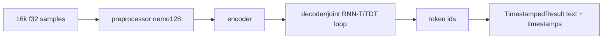

> Part of [Module Guide](CODEBASE_MAP_MODULES.md) | [Codebase Map](CODEBASE_MAP.md)

# Module: Parakeet Engine

## Overview

**Purpose**: Streaming ONNX transcription using NVIDIA Parakeet-TDT models. The `ParakeetModel` (model.rs) runs a 3-session ONNX pipeline (preprocessor `nemo128` → encoder → decoder/joint) implementing streaming-style RNN-T greedy and TDT duration-based token decoding. `ParakeetEngine` (parakeet_engine.rs) handles model discovery, quantization awareness, streaming download with resume, lifecycle, and transcription (wrapping inference in `catch_unwind`).

**Entry point**: `parakeet_engine/mod.rs` — module root.

**Sub-packages**: None (single directory).

## File Reference

| File | Purpose | Key Exports | Tokens |
|------|---------|-------------|--------|
| `mod.rs` | Module root, re-exports | `ParakeetEngine`, `ParakeetModel`, errors | <1k |
| `parakeet_engine.rs` | Engine layer: model lifecycle, quantization, download/resume, transcription | `ParakeetEngine`, `ModelInfo`, `QuantizationType`, `DownloadProgress` | ~9k |
| `model.rs` | ONNX `ParakeetModel`: 3-session pipeline + streaming decode | `ParakeetModel`, `TimestampedResult`, `DecoderState`, `ParakeetError` | ~5k |
| `commands.rs` | Tauri commands + global `PARAKEET_ENGINE` singleton | `parakeet_*` commands, `PARAKEET_ENGINE` | ~4k |

## Public API

### Key Functions (Tauri Commands)

| Function | Signature | Description |
|----------|-----------|-------------|
| `parakeet_init` | `() -> Result<(), String>` | Create engine if not present |
| `parakeet_get_available_models` | `() -> Result<Vec<ModelInfo>, String>` | Discover models |
| `parakeet_load_model` | `(app_handle, model_name) -> Result<(), String>` | Load; emits `parakeet-model-loading-*` |
| `parakeet_get_current_model` / `parakeet_is_model_loaded` | `() -> Result<.., String>` | State queries |
| `parakeet_validate_model_ready` | `() -> Result<String, String>` | Load first available, preferring Int8 |
| `parakeet_transcribe_audio` | `(audio_data: Vec<f32>) -> Result<String, String>` | Transcribe |
| `parakeet_download_model` | `(app_handle, model_name) -> Result<(), String>` | Multi-file weighted download w/ resume; emits `parakeet-model-download-*` |
| `parakeet_retry_download` | `(app_handle, model_name) -> Result<(), String>` | Defensive retry (clears active downloads) |
| `parakeet_cancel_download` / `parakeet_delete_corrupted_model` | `(model_name) -> Result<.., String>` | Cancel / delete |
| `open_parakeet_models_folder` | `() -> Result<(), String>` | Open models dir |

### Key Types

```rust
struct ParakeetEngine {
    models_dir: PathBuf,
    current_model: Arc<RwLock<Option<ParakeetModel>>>,
    current_model_name: Arc<RwLock<Option<String>>>,
    available_models: Arc<RwLock<HashMap<String, ModelInfo>>>,
    cancel_download_flag: Arc<RwLock<Option<String>>>,
    active_downloads: Arc<RwLock<HashSet<String>>>,
}

struct ParakeetModel {           // NOT thread-safe (ort::Session is !Sync); all run methods take &mut self
    encoder: Session, decoder_joint: Session, preprocessor: Session,
    vocab: Vec<String>, blank_idx: i32, vocab_size: usize,
}

enum QuantizationType { FP32, Int8 }   // default Int8
```

## Internal Architecture

### ONNX Streaming Inference (`model.rs`)



- `ParakeetModel::new(model_dir, quantized)` loads `encoder-model[.int8].onnx`, `decoder_joint-model[.int8].onnx`, `nemo128.onnx`, `vocab.txt`. All sessions use **CPUExecutionProvider** only.
- `decode_sequence` is the streaming/token loop: handles two decoder output shapes — `total_logits == vocab_size` (plain RNN-T greedy) and `total_logits > vocab_size` (TDT: vocab logits + duration logits). `prev_t` forward-progress guard forces `t += 1` to prevent infinite loops; `MAX_TOKENS_PER_STEP = 3` caps same-frame emissions.
- `decode_tokens` maps ids→tokens with a spacing regex; timestamps computed as `WINDOW_SIZE (0.01) * SUBSAMPLING_FACTOR (8) * t`.
- `transcribe_samples` validates ≥1600 samples (100ms @16k), builds `[1, N]` arrays, returns first `TimestampedResult`.

### Engine Layer (`parakeet_engine.rs`)

- `discover_models` catalogs 2 models: `parakeet-tdt-0.6b-v3-int8` (670MB) and `parakeet-tdt-0.6b-v2-int8` (661MB). **No FP32 in the catalog** (FP32 flow exists but is unreachable).
- `download_model_detailed` does multi-file weighted download with **resume** (Range header), 30s per-chunk timeout, 1h client timeout, 8MB `BufWriter`, 500ms progress; `416` triggers delete-and-retry. Partial files kept on cancel for resume.
- `transcribe_audio` takes a **write** lock on `current_model` and wraps `transcribe_samples` in `catch_unwind` — on panic it unloads the model and returns a descriptive error (ORT native code can hang/segfault on corrupted models).

### Concurrency Model

`ParakeetModel` is not thread-safe; `ParakeetEngine` holds it in `Arc<RwLock<Option<ParakeetModel>>>` and takes a write lock for the whole transcription, serializing all inference.

## Dependencies (imports FROM)

| Module/Package | What is imported | Why |
|---------------|-----------------|-----|
| `ort` | `CPUExecutionProvider`, `inputs`, `GraphOptimizationLevel`, `Session`, `TensorRef` | ONNX inference |
| `ndarray`, `regex`, `once_cell`, `thiserror` | Arrays / token spacing / lazy regex / errors | Runtime helpers |
| `reqwest`, `tokio`, `futures_util` | HTTP download | Model download |
| `config` | `DEFAULT_PARAKEET_MODEL` | Default model name |

## Dependents (imported BY)

| Consumer Module | What it uses | Context |
|----------------|-------------|---------|
| `audio/transcription/engine.rs`, `parakeet_provider.rs` | `PARAKEET_ENGINE`, `ParakeetEngine` | Live transcription |
| `audio/import.rs`, `retranscription.rs`, `common.rs` | `PARAKEET_ENGINE` | Import / re-transcribe / unload |
| `audio/recording_commands.rs` | `PARAKEET_ENGINE` | Model validation on start |
| `tray.rs`, `lib.rs` | Commands | Registration / tray |

## Configuration

| Parameter | Default | Description |
|-----------|---------|-------------|
| `DEFAULT_PARAKEET_MODEL` | `parakeet-tdt-0.6b-v3-int8` | Config fallback (config.rs) |
| Quantization | Int8 | Only Int8 downloadable; FP32 flow present but unreachable |
| Runtime | CPU-only | No GPU provider for Parakeet |
| Decode | `MAX_TOKENS_PER_STEP=3`, `WINDOW_SIZE=0.01`, `SUBSAMPLING_FACTOR=8`, `TDT_DURATIONS=[0,1,2,3,4]` | Streaming token decoding |
| Download | client timeout 3600s, per-chunk 30s, resume tolerance 1% | Robust downloads |
| Download URLs | v3 → self-hosted `meetily.towardsgeneralintelligence.com`; v2 → HuggingFace | External availability dependency |

## Error Handling

- `ParakeetError` (model.rs, thiserror): `Ort`, `Io`, `Shape`, `InputNotFound`, `OutputNotFound`, `TensorShape`.
- `ParakeetEngineError` (engine.rs): **essentially unused** — only `Display`/`Error` impls; methods return `anyhow::Result`.
- Downloads meticulously remove from `active_downloads` and reset status to `Missing` on every failure/timeout/cancel.
- `catch_unwind` around inference guards against ORT native crashes.

## Concurrency and Thread Safety

- All inference serialized through a write lock on `current_model` (blocks unload/switch during transcription — acceptable for serial use).
- Global `PARAKEET_ENGINE` via `std::sync::Mutex<Option<Arc<ParakeetEngine>>>`.

## Gotchas and Tech Debt

- **CPU-only despite doc claims** of "GPU cross-platform" — `init_session` only registers `CPUExecutionProvider`.
- **`ParakeetEngineError` is dead** (unused error surface); two error enums for one engine (`ParakeetError` + `ParakeetEngineError`).
- **v3 download URL is self-hosted** (`meetily.towardsgeneralintelligence.com`), not HuggingFace — external availability risk.
- Resume correctness depends on the server honoring `Range`; `416` triggers delete-and-retry.
- FP32 flow is unreachable from the catalog — effectively only Int8 is used.
- Heavy `log::info!` in hot inference paths (`recognize_batch`, `decode_sequence`, `transcribe_samples`) — potential overhead.
- `create_decoder_state` hardcodes batch=1 and channel dim 640.
- Redundant `download_model` (u8-callback) wrapper preserved only for symmetry with Whisper.
