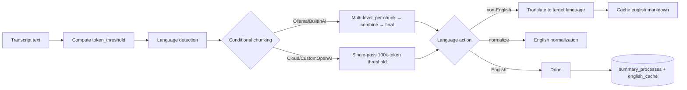

> Part of [Module Guide](CODEBASE_MAP_MODULES.md) | [Codebase Map](CODEBASE_MAP.md)

# Module: Summary Engine

## Overview

**Purpose**: Multi-provider AI meeting summarization. Orchestrates chunked, multi-pass LLM generation to turn a transcript into a structured markdown report, with automatic language detection, template-based prompts, an English-normalization/translation path, result caching, a per-meeting cancellation registry, and a **new LLM debug-logging facility** (`debug_log.rs`). Also hosts the **"builtin-ai"** local sidecar engine (`summary_engine/`).

**Entry point**: `summary/mod.rs` — module root (defines `CustomOpenAIConfig`, re-exports commands).

**Sub-packages**:
- `summary_engine/` — Built-in AI provider: llama-helper sidecar client, model manager, model defs, sidecar process manager.
- `templates/` — Template system (custom → bundled → built-in JSON templates).

> **Provider note:** The LLM provider adapters for Ollama/OpenAI/Anthropic/Groq/OpenRouter are dispatched from `llm_client.rs` here; there are no separate `ollama/`/`openai/`/`anthropic/` provider modules anymore.

## File Reference

| File | Purpose | Key Exports | Tokens |
|------|---------|-------------|--------|
| `mod.rs` | Module root + `CustomOpenAIConfig` + re-exports | `CustomOpenAIConfig` | ~1k |
| `commands.rs` | Tauri IPC command layer | `api_process_transcript`, `api_get_summary`, `api_cancel_summary`, language/template commands | ~3k |
| `service.rs` | Orchestration + state machine + caching + cancellation | `SummaryService`, `EnglishSummaryCache` | ~7k |
| `processor.rs` | Chunked summarization algorithm + markdown cleaning | `generate_meeting_summary`, `chunk_text`, `clean_llm_markdown_output` | ~6.6k |
| `llm_client.rs` | Multi-provider HTTP LLM client + BuiltInAI dispatch | `LLMProvider`, `generate_summary`, `ChatRequest` | ~3.2k |
| `debug_log.rs` | **NEW** per-request LLM debug logging | `DebugLogEntry`, `DebugLogResult`, `next_iteration`, `write_debug_log` | <1k |
| `language_detection.rs` | Automatic transcript language detection (whatlang) | `detect_summary_language`, `SummaryLanguageDetection` | ~1.6k |
| `metadata.rs` | Per-meeting summary language persistence in metadata.json | `read/write_summary_language_*`, `read/write_detected_summary_language_*` | ~2k |
| `template_commands.rs` | Template listing/detail/validation commands | `api_list_templates`, `api_get_template_details`, `api_validate_template` | ~1k |
| `templates/mod.rs` | Template subsystem facade | re-exports `Template`, `TemplateSection` | <1k |
| `templates/defaults.rs` | Embedded built-in templates | `get_builtin_templates` (daily_standup, standard_meeting) | <1k |
| `templates/loader.rs` | Template resolution hierarchy (custom→bundled→built-in) | `get_template`, `list_templates`, `set_bundled_templates_dir` | ~1.7k |
| `templates/types.rs` | Template domain types | `Template`, `TemplateSection` | ~1k |
| `summary_engine/mod.rs` | Built-in AI engine facade | re-exports client/commands/model_manager/models | <1k |
| `summary_engine/client.rs` | High-level built-in AI client + global sidecar manager singleton | `generate_with_builtin`, `is_sidecar_healthy`, `shutdown_sidecar_gracefully` | ~3.4k |
| `summary_engine/commands.rs` | Built-in AI Tauri commands + `ModelManagerState` | `builtin_ai_*` commands | ~3k |
| `summary_engine/model_manager.rs` | Built-in model downloads/management | `ModelInfo`, `ModelStatus`, `ModelManagerState` | ~6.3k |
| `summary_engine/models.rs` | Model definitions + prompt formatting | `ModelDef`, `get_available_models`, `format_prompt` | ~5k |
| `summary_engine/sidecar.rs` | llama-helper sidecar process/IO manager | `SidecarManager` | ~5.4k |

## Public API

### Key Functions (Tauri Commands)

| Function | Signature | Description |
|----------|-----------|-------------|
| `api_process_transcript` | `(app, state, text, model, model_name, meeting_id?, chunk_size?, overlap?, custom_prompt?, template_id?, summary_language?, auth_token?) -> ProcessTranscriptResponse` | Kicks off background summarization; returns `process_id` immediately |
| `api_get_summary` | `(app, state, meeting_id, auth_token?) -> SummaryResponse` | Reads `summary_processes`; shows result even after failure/cancel |
| `api_cancel_summary` | `(app, state, meeting_id) -> Result<Value, String>` | Cancels via `SummaryService::cancel_summary` |
| `api_save_meeting_summary` | `(app, state, meeting_id, summary) -> Result<Value, String>` | Persist summary |
| `api_get/save_meeting_summary_language` | `(app, state, meeting_id, language?) -> MeetingSummaryLanguagePreference` | Per-meeting override |
| `api_get/save_meeting_detected_summary_language` | `(app, state, meeting_id, detected?) -> MeetingSummaryLanguagePreference` | Cached auto-detected language |
| `api_detect_transcript_summary_language` | `(transcript_texts: Vec<String>) -> SummaryLanguageDetection` | Stateless detection |
| `api_list_templates` / `api_get_template_details` / `api_validate_template` | `(app, template_id?) -> Result<.., String>` | Template UI |

### Key Types

```rust
struct CustomOpenAIConfig { endpoint: String, api_key: Option<String>, model: String,
                            max_tokens: Option<i32>, temperature: Option<f32>, top_p: Option<f32> }

enum LLMProvider { OpenAI, Claude, Groq, Ollama, OpenRouter, BuiltInAI, CustomOpenAI }
// LLMProvider::from_str(s) — case-insensitive; aliases builtin-ai/local-llama/localllama → BuiltInAI

// process_transcript_background(app, pool, meeting_id, text, model_provider, model_name,
//   custom_prompt, template_id, summary_language) -> ()   // full async pipeline, no return
```

## Internal Architecture

### Summarization Flow



1. **`commands.rs`** normalizes input, `create_or_reset_process`, saves transcript chunks, spawns `SummaryService::process_transcript_background`.
2. **`service.rs`** computes the token threshold (Ollama fallback 4000; BuiltInAI 1748; cloud 100000), detects/reads language, loads template, calls `generate_meeting_summary`, and writes completed/failed/cancelled status (distinguishing cancel via **string matching `"cancelled"`**). Maintains an `EnglishSummaryCache` under the `english_cache` field for cheap regeneration.
3. **`processor.rs`** runs the multi-pass algorithm: chunk → per-chunk summary → combine → final report, then optional translation/normalization. Uses a `FinalLanguageAction` decision based on `summary_language` + `detected_transcript_language`.
4. **`llm_client.rs`** builds provider-specific URLs/headers/bodies; only `CustomOpenAI` receives `max_tokens/temperature/top_p`; Claude uses `ClaudeRequest` with `max_tokens=2048`; **non-streaming only**. Dispatches `BuiltInAI` to `summary_engine`.
5. **`summary_engine/`** runs the built-in local engine via the **llama-helper sidecar**: `client.rs` resolves a `ModelDef`, formats the prompt via `models::format_prompt`, ensures the sidecar is running, sends a `Generate` request (900s timeout), races against cancellation, and on cancel kills the sidecar.

### LLM Debug Logging (`debug_log.rs`) — NEW

Wired into both `llm_client.rs` and `summary_engine/client.rs`. Each LLM call writes a JSON file `{YYYYMMDD_HHMMSS}_it_{iteration}.log` into the meeting folder containing the full request payload and response/error. `service.rs` calls `reset_iteration_counter()` per run. `DEBUG = true` is a hardcoded compile-time flag (currently always on).

## Dependencies (imports FROM)

| Module/Package | What is imported | Why |
|---------------|-----------------|-----|
| `database` repositories | `MeetingsRepository`, `SettingsRepository`, `SummaryProcessesRepository`, `TranscriptChunksRepository` | Persistence |
| `state` | `AppState` | DB pool access |
| `ollama::metadata` | `ModelMetadataCache` | Dynamic Ollama context sizing |
| `reqwest`, `tokio_util::sync::CancellationToken` | HTTP client, cancellation | LLM calls + cancellation |

## Dependents (imported BY)

| Consumer Module | What it uses | Context |
|----------------|-------------|---------|
| `lib.rs` | Summary + summary_engine + template commands | Command registration; `force_shutdown_sidecar` on exit |
| `api/api.rs` | `shutdown_sidecar_gracefully` | On model-config save |
| `database/commands.rs` | `get_recommended_summary_model_for_current_system` | Default seeding |
| Frontend | `api_*` commands | Summary UI (settings, meeting details) |

## Configuration

| Parameter | Default | Description |
|-----------|---------|-------------|
| Fallback context sizes | Ollama 4000 / BuiltInAI 1748 / cloud 100000 | Token threshold; overhead reservation 300 |
| `REQUEST_TIMEOUT_DURATION` | 300s | HTTP client timeout (error string wrongly says "60 seconds") |
| `GENERATION_TIMEOUT_SECS` | 900s | Built-in sidecar generation timeout |
| Claude `max_tokens` | 2048 | Hardcoded ceiling |
| `METADATA_CACHE` TTL | 300s | Ollama model metadata cache |
| `_chunk_size` / `_overlap` | accepted but ignored | Real chunking uses `token_threshold` in service.rs |
| `debug_log::DEBUG` | `true` | Kill-switch for debug logging (compile-time) |

## Error Handling

- Provider parse failure / missing API key / missing CustomOpenAI config / template load failure → `update_process_failed`.
- On `Err`, message containing `"cancelled"` → DB `cancelled` status; else `failed`. **Brittle string matching.**
- `processor.rs`: per-chunk non-cancel errors logged + skipped; if all chunks fail → hard error. Cancellation checks at each step.
- Debug logging is deliberately best-effort (all I/O/parse errors swallowed).

## Concurrency and Thread Safety

- Background generation via `tauri::async_runtime`; per-meeting `CancellationToken` registry (`std::sync::Mutex<HashMap<..>>` — brief blocking in async context).
- `METADATA_CACHE` is process-global shared across meetings.
- `metadata.rs` uses a process-wide `METADATA_WRITE_LOCK` (std Mutex) + atomic temp-file+rename for concurrent field writes.
- No streaming; single 300s window per call.

## Gotchas and Tech Debt

- **Debug logging writes a plaintext file per LLM call** including full request/response bodies (transcript content, prompts, outputs) into the meeting folder — a **privacy/security consideration**. `DEBUG = true` hardcoded on with no runtime toggle or cleanup/rotation.
- **Recording-start model gate is provider-aware**: `audio/transcription/commands.rs::check_active_transcription_model_ready` + `engine.rs::validate_transcription_model_ready` now dispatch on the persisted transcript provider (Whisper vs Parakeet) instead of assuming Whisper; the frontend (`useRecordingStart`) and tray gate recording on the result.
- **Conditional chunking only for Ollama/BuiltInAI**; cloud providers assume huge context windows (approximation).
- **English base instruction duplicated** into three prompt builders.
- **Timeout message mismatch** (says 60s, constant is 300s).
- **BuiltInAI dispatched inside the HTTP client** — coupling the HTTP layer to the sidecar subsystem (though it's the clean single-dispatch point).
- **`init_sidecar_manager` is never called** (self-initializes on demand); `summary_engine` exposes two global singletons (sidecar manager + `ModelManagerState` Tauri state).
- **No streaming**; `_chunk_size`/`_overlap` hidden protocol mismatch; `api_detect_transcript_summary_language` signature says `Result` but never errors.
- Template edits require restart (no file watching); custom templates can silently override built-ins.
- `_auth_token` accepted but unused throughout (vestigial).
