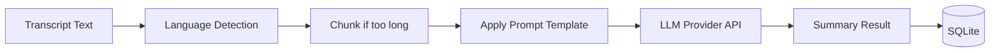

> Part of [Module Guide](CODEBASE_MAP_MODULES.md) | [Codebase Map](CODEBASE_MAP.md)

# Module: Summary Engine

## Overview

**Purpose**: The summary engine module provides AI-powered meeting summarization using multiple LLM providers (Ollama, OpenAI, Anthropic Claude, Groq, OpenRouter). It handles transcript processing, language detection, template-based prompt generation, and summary storage. Supports both local models (via Ollama) and cloud APIs.

**Entry point**: `summary/mod.rs` — module root
**Sub-packages**:
- `summary_engine/` — Core summarization logic
- `templates/` — Prompt templates for different summary types
- `ollama/`, `openai/`, `anthropic/`, `groq/`, `openrouter/` — Provider-specific clients

## File Reference

| File | Purpose | Key Exports | Tokens |
|------|---------|-------------|--------|
| `mod.rs` | Module root, re-exports all sub-modules | summary types, commands | ~1k |
| `processor.rs` | Core summarization processor | process_summary(), build_prompt() | ~8k |
| `service.rs` | Summary service orchestration | SummaryService, full workflow | ~6k |
| `commands.rs` | Tauri command handlers | summarize_meeting, get_summaries | ~5k |
| `language_detection.rs` | Detect transcript language | detect_language() | ~3k |
| `llm_client.rs` | Generic LLM client abstraction | LlmClient trait, provider selection | ~4k |
| `metadata.rs` | Summary metadata management | SummaryMetadata struct | ~2k |
| `template_commands.rs` | Template management commands | list_templates, create_template | ~3k |

### summary_engine/ sub-package

| File | Purpose | Key Exports | Tokens |
|------|---------|-------------|--------|
| `mod.rs` | Summary engine module root | re-exports | ~1k |
| `summary_processor.rs` | Core summarization logic | process_summary(), chunk_transcript() | ~8k |
| `prompt_builder.rs` | Build LLM prompts from templates | build_prompt(), apply_template() | ~5k |

### templates/ sub-package

| File | Purpose | Key Exports | Tokens |
|------|---------|-------------|--------|
| `mod.rs` | Template module root | template types | ~1k |
| `default_summary.md` | Default summary prompt template | — | ~1k |
| `action_items.md` | Action items extraction template | — | ~1k |
| `executive_summary.md` | Executive summary template | — | ~1k |

### AI Provider sub-packages (ollama, openai, anthropic, groq, openrouter)

Each provider follows the same pattern:
| File | Purpose | Key Exports | Tokens |
|------|---------|-------------|--------|
| `mod.rs` | Module root | re-exports | ~0.5k |
| `ollama.rs`/`openai.rs` etc. | Provider-specific API client | ProviderClient, send_request() | ~3-5k |
| `commands.rs` (some) | Tauri command handlers for provider | provider_init, model_list | ~2k |

## Public API

### Key Functions (Tauri Commands)

| Function | Signature | Description |
|----------|-----------|-------------|
| `summarize_meeting` | `(meeting_id, transcript_text, config?) -> Result<SummaryResult, String>` | Generate AI summary for a meeting |
| `get_summaries_for_meeting` | `(meeting_id) -> Result<Vec<SummaryEntry>, String>` | Get all summaries for a meeting |
| `get_all_summaries` | `() -> Result<Vec<SummaryEntry>, String>` | Get all summaries across meetings |
| `delete_summary` | `(summary_id) -> Result<(), String>` | Delete a summary entry |
| `update_summary` | `(summary_id, new_content) -> Result<(), String>` | Update summary content |
| `get_available_ollama_models` | `() -> Result<Vec<String>, String>` | List available Ollama models |
| `download_ollama_model` | `(model_name) -> Result<(), String>` | Download model to local Ollama |
| `detect_language` | `(text) -> Result<String, String>` | Detect language of text |

### Key Types

```rust
struct SummaryService {
    db: DBManager,
    config: SummaryConfig,
}

enum LlmProvider {
    Ollama(OllamaClient),
    OpenAI(OpenAIClient),
    Anthropic(AnthropicClient),
    Groq(GroqClient),
    OpenRouter(OpenRouterClient),
}

struct SummaryResult {
    content: String,
    provider: String,
    model: String,
    token_count: usize,
    duration_ms: u64,
}

enum SummaryType {
    Default,
    ActionItems,
    ExecutiveSummary,
}
```

## Internal Architecture

### Summarization Flow




1. **Input**: Transcript text from recording or manual entry
2. **Language Detection**: Auto-detect language using `language_detection.rs`
3. **Chunking**: If transcript exceeds context window, split into chunks
4. **Prompt Building**: Apply template-based prompt with system instructions
5. **Provider Selection**: Route to configured LLM provider (Ollama/OpenAI/etc.)
6. **Response Processing**: Parse and validate LLM response
7. **Storage**: Save summary to SQLite database

### Template System

Templates are markdown files in `templates/` directory that define:
- System prompt instructions
- Output format expectations
- Variable placeholders for customization

```markdown
<!-- templates/default_summary.md -->
# Meeting Summary
Please summarize the following meeting transcript...
Key topics discussed:
Action items identified:
Decisions made:
```

### Concurrency Model

- Summarization runs in tokio task (may be long-running API call)
- Language detection is lightweight, runs inline
- Template loading uses `include_str!` for compile-time embedding
- Provider clients use async HTTP (reqwest)

## Dependencies (imports FROM)

| Module/Package | What is imported | Why |
|---------------|-----------------|-----|
| `database` | `DBManager`, repository types | Save/retrieve summaries from SQLite |
| `config` | Application config | Provider selection, API keys |
| `reqwest` | HTTP client | API calls to cloud providers |
| `ollama` (Python) | Ollama Python SDK | Local model management |

## Dependents (imported BY)

| Consumer Module | What it uses | Context |
|----------------|-------------|---------|
| `lib.rs` (main) | All Tauri commands | Entry point for frontend summary requests |
| Frontend pages | Summary data from DB | Display summaries in UI |

## Configuration

| Parameter | Default | Description |
|-----------|---------|-------------|
| `llm_provider` | Ollama | Default LLM provider for summarization |
| `model_name` | llama3.2 | Model to use with selected provider |
| `summary_type` | Default | Default summary template type |
| `max_context_length` | 8000 tokens | Max transcript length before chunking |
| `temperature` | 0.7 | LLM temperature for summarization |

### Provider Configuration

```rust
struct SummaryConfig {
    provider: LlmProvider,
    model_name: String,
    api_key: Option<String>,
    base_url: Option<String>,
    temperature: f32,
}
```

## Error Handling

- **API rate limit**: Retry with exponential backoff (configurable)
- **Model not found**: Prompt user to download/select different model
- **Context overflow**: Auto-chunk transcript and summarize in parts
- **Provider unavailable**: Fall back to configured fallback provider

## Concurrency and Thread Safety

- `Arc<RwLock<SummaryService>>` for shared service state
- Tokio tasks for async API calls
- No parallel summarization (single summary per meeting at a time)

## Gotchas and Tech Debt

- **Token limits**: Different providers have different context window sizes — must be handled dynamically
- **Ollama startup**: Local Ollama server may take time to start — should show loading state in UI
- **Template versioning**: Templates are static files; no version management currently
- **Provider API changes**: Each provider's response format may change independently