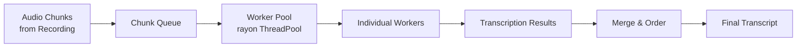

> Part of [Module Guide](CODEBASE_MAP_MODULES.md) | [Codebase Map](CODEBASE_MAP.md)

# Module: Whisper Engine

## Overview

**Purpose**: The Whisper engine module provides speech-to-text transcription using the Whisper.cpp C library via Rust bindings (`whisper-rs`). It manages model loading/unloading, GPU acceleration (Metal/CUDA/Vulkan), parallel chunk processing for real-time recording transcription, and model download management. Supports both local CPU and GPU-accelerated inference.

**Entry point**: `whisper_engine/mod.rs` — module root
**Sub-packages**: None (single directory)

## File Reference

| File | Purpose | Key Exports | Tokens |
|------|---------|-------------|--------|
| `mod.rs` | Module root, re-exports all sub-modules | whisper_engine types, commands | ~1k |
| `whisper_engine.rs` | Core Whisper.cpp wrapper | WhisperEngine struct, load/unload/transcribe | ~15k |
| `commands.rs` | Tauri command handlers | whisper_init, transcribe_audio, download_model | ~8k |
| `parallel_commands.rs` | Parallel processing commands | initialize_parallel_processor, start_parallel_processing | ~6k |
| `parallel_processor.rs` | Parallel chunk processor | ParallelProcessor, worker pool management | ~10k |
| `acceleration.rs` | GPU acceleration detection/config | detect_acceleration(), get_backend() | ~3k |
| `system_monitor.rs` | System resource monitoring | CPU/GPU/memory monitoring for parallel processing | ~4k |

## Public API

### Key Functions (Tauri Commands)

| Function | Signature | Description |
|----------|-----------|-------------|
| `whisper_init` | `(app) -> Result<(), String>` | Initialize Whisper engine and load default model |
| `whisper_load_model` | `(model_path) -> Result<(), String>` | Load a specific model from path |
| `whisper_unload_model` | `() -> Result<(), String>` | Unload current model from memory |
| `whisper_is_model_loaded` | `() -> bool` | Check if model is currently loaded |
| `whisper_get_current_model` | `() -> Option<String>` | Get name of currently loaded model |
| `whisper_transcribe_audio` | `(audio_path) -> Result<TranscriptionResult, String>` | Transcribe a single audio file |
| `whisper_get_available_models` | `() -> Vec<AvailableModel>` | List all available/installed models |
| `whisper_download_model` | `(model_name) -> Result<DownloadHandle, String>` | Download model from HuggingFace |
| `whisper_cancel_download` | `(download_id) -> Result<(), String>` | Cancel an in-progress download |
| `whisper_get_models_directory` | `() -> PathBuf` | Get path to models storage directory |
| `initialize_parallel_processor` | `(app, config) -> Result<(), String>` | Initialize parallel chunk processor |
| `start_parallel_processing` | `(audio_stream) -> Result<ProcessorHandle, String>` | Start parallel transcription processing |
| `pause_parallel_processing` | `() -> Result<(), String>` | Pause parallel processing |
| `resume_parallel_processing` | `() -> Result<(), String>` | Resume paused processing |
| `stop_parallel_processing` | `() -> Result<Vec<TranscriptionResult>, String>` | Stop and collect all results |
| `get_system_resources` | `() -> SystemResources` | Get current CPU/GPU/memory stats |

### Key Types

```rust
struct WhisperEngine {
    context: whisper_rs::Context,
    full_params: FullParams,
    model_path: PathBuf,
}

struct ParallelProcessor {
    worker_pool: ThreadPool,
    chunk_queue: mpsc::Sender<AudioChunk>,
    is_running: AtomicBool,
    config: ParallelConfig,
}

enum ModelSize {
    Tiny,
    Base,
    Small,
    Medium,
    Large,
    LargeV3,
}

struct AvailableModel {
    name: String,
    size: ModelSize,
    path: PathBuf,
    is_downloading: bool,
    download_progress: Option<f64>,
}
```

## Internal Architecture

### Model Loading Flow

1. **Detection**: `acceleration.rs` detects available GPU (Metal on macOS, CUDA/Vulkan on Windows/Linux)
2. **Configuration**: FullParams configured based on detected acceleration backend
3. **Loading**: Model file loaded from models directory into whisper-rs context
4. **Verification**: Model validated via `whisper_validate_model_ready()` command

### Parallel Processing Architecture



- Chunks arrive from audio engine via mpsc channel
- Parallel processor distributes chunks across rayon thread pool
- Results are ordered by chunk sequence number before merging
- Configurable worker count based on system resources (detected by `system_monitor.rs`)

### Concurrency Model

- **Model loading**: Blocking operation in tokio spawn to avoid blocking async runtime
- **Parallel processing**: rayon ThreadPool for CPU-bound inference tasks
- **Chunk queue**: tokio mpsc channel for async chunk delivery from recording pipeline
- **Resource monitoring**: Periodic tokio task polling system resources

## Dependencies (imports FROM)

| Module/Package | What is imported | Why |
|---------------|-----------------|-----|
| `whisper-rs` | `Context`, `FullParams`, `GlobalOptions` | Whisper.cpp Rust bindings |
| `ort` | ONNX runtime types | For model format detection |
| `rayon` | `ThreadPool`, `join` | Parallel chunk processing |
| `tokio` | `sync::mpsc`, `spawn` | Async chunk delivery and task management |

## Dependents (imported BY)

| Consumer Module | What it uses | Context |
|----------------|-------------|---------|
| `audio/transcription/` | Transcribe audio chunks | Real-time transcription during recording |
| `summary/` | Transcript text from completed recordings | AI summarization input |
| `lib.rs` (main) | All Tauri commands | Entry point for frontend control |

## Configuration

| Parameter | Default | Description |
|-----------|---------|-------------|
| `model_size` | base | Default model size (tiny/base/small/medium/large) |
| `gpu_device` | Auto-detect | GPU device ID for CUDA/Vulkan/Metal |
| `n_threads` | CPU core count / 2 | Number of parallel threads for inference |
| `n_threads_batch` | CPU core count | Batch processing thread count |
| `offset_ms` | 0 | Offset in milliseconds for partial transcription |
| `duration_ms` | 0 (full file) | Duration to transcribe from offset |
| `language` | auto-detect | Source language for transcription |

### GPU Backend Selection

```rust
// Platform defaults:
macOS → Metal + CoreML (if Apple Silicon)
Windows → CUDA (NVIDIA) or Vulkan (AMD/Intel)
Linux → CUDA / Vulkan / ROCm (based on hardware)
```

## Error Handling

- **Model not found**: Returns error with path to models directory for download
- **GPU memory insufficient**: Falls back to CPU inference automatically
- **Invalid model file**: Deleted via `whisper_delete_corrupted_model()` and re-downloaded
- **Transcription timeout**: Configurable timeout per chunk; partial results returned

## Concurrency and Thread Safety

- `Arc<Mutex<WhisperEngine>>` for shared engine state
- Rayon ThreadPool with configurable worker count
- Tokio mpsc channel for async chunk delivery
- Atomic flags for processing state (running/paused/stopped)

## Gotchas and Tech Debt

- **Model download blocking**: Large models (large-v3 ~1.5GB) can take significant time; progress must be tracked asynchronously
- **GPU memory management**: Loading large models on devices with <8GB VRAM may cause OOM — auto-fallback to CPU exists but should be more robust
- **Vulkan on Windows**: Requires Vulkan SDK; some NVIDIA drivers have compatibility issues
- **CoreML on macOS**: Only available on Apple Silicon (M1/M2/M3); Intel Macs fall back to CPU
- **Model file format**: Models stored in GGUF format; version mismatches between whisper-rs and model can cause silent errors