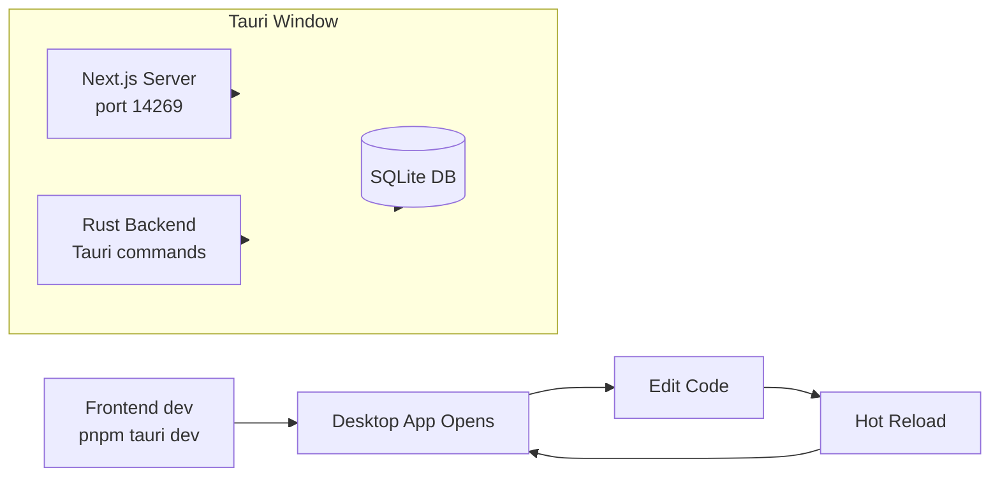

> Part of [Codebase Map](CODEBASE_MAP.md)

# Operations & Deployment

## Build Commands

### Frontend (Tauri + Next.js)

| Command | Description | Location |
|---------|-------------|----------|
| `pnpm install` | Install dependencies | frontend/ |
| `pnpm dev` | Start Next.js dev server | frontend/ |
| `pnpm tauri dev` | Run Tauri desktop app in dev mode | frontend/ |
| `pnpm tauri build` | Build production desktop app | frontend/ |
| `pnpm build` | Build Next.js production bundle | frontend/ |
| `./build.bat` / `./build.ps1` | Windows batch build scripts | frontend/ |
| `./build.sh` | Linux/Mac build script | frontend/ |

### Rust Backend (Tauri)

| Command | Description |
|---------|-------------|
| `cargo build` | Build debug binary |
| `cargo build --release` | Build optimized release binary |
| `cargo clippy` | Run linter |
| `cargo test` | Run tests |

### Python Backend (Optional)

| Command | Description | Location |
|---------|-------------|----------|
| `pip install -r requirements.txt` | Install Python dependencies | backend/ |
| `python main.py` | Start Python server | backend/ |

## Development Workflow



### Dev Environment Setup

1. **Install prerequisites**: Node.js 20+, pnpm, Rust toolchain, Python 3.10+
2. **Frontend dependencies**: `cd frontend && pnpm install`
3. **Rust dependencies**: `cargo build` (downloads whisper.cpp, ort, etc.)
4. **Optional Python**: `cd backend && pip install -r requirements.txt`
5. **Run dev**: `pnpm tauri dev` from frontend/

## Production Build Process

### Desktop App (Tauri)

```bash
# 1. Install dependencies
pnpm install

# 2. Build Next.js production bundle
pnpm build

# 3. Build Tauri app (creates platform-specific installer)
pnpm tauri build
```

Output locations:
- **Windows**: `frontend/src-tauri/target/release/`
- **macOS**: `frontend/src-tauri/target/release/`
- **Linux**: `frontend/src-tauri/target/release/`

### Docker (Backend Server)

| Image | Purpose | File |
|-------|---------|------|
| `meetily-server-cpu` | CPU-only server | `backend/Dockerfile.server-cpu` |
| `meetily-server-gpu` | GPU-accelerated server | `backend/Dockerfile.server-gpu` |
| `meetily-app` | Full app with frontend | `backend/Dockerfile.app` |

```bash
# Build CPU-only server
docker build -t meetily-server-cpu -f backend/Dockerfile.server-cpu backend/

# Build GPU server (requires NVIDIA container toolkit)
docker build -t meetily-server-gpu -f backend/Dockerfile.server-gpu backend/

# Run with GPU
docker run --gpus all -p 8000:8000 meetily-server-gpu
```

## Configuration Files

| File | Purpose | Location |
|------|---------|----------|
| `tauri.conf.json` | Tauri app config (name, version, windows) | frontend/src-tauri/ |
| `Cargo.toml` | Rust dependencies and features | root + frontend/src-tauri/ |
| `package.json` | Node.js dependencies and scripts | frontend/ |
| `.env` / `.env.local` | Environment variables | frontend/ |
| `requirements.txt` | Python backend dependencies | backend/ |

### Key Tauri Config (`tauri.conf.json`)

```json
{
  "productName": "Meetily",
  "version": "1.0.0",
  "identifier": "com.meetily.app",
  "app": {
    "windows": [
      {
        "title": "Meetily",
        "width": 1200,
        "height": 800
      }
    ]
  },
  "bundle": {
    "activeTargetPlatform": "deb",
    "icon": ["icons/"]
  }
}
```

## Runtime Dependencies

### Desktop App (Tauri)

| Dependency | Version | Purpose |
|------------|---------|---------|
| `tauri` | 2.x | Desktop framework |
| `whisper-rs` | latest | Whisper.cpp bindings |
| `ort` | latest | ONNX Runtime |
| `sqlx` | 0.7+ | Async SQLite |
| `portaudio` | system | Audio capture |

### Frontend (Node.js)

| Dependency | Version | Purpose |
|------------|---------|---------|
| `next` | 14+ | React framework |
| `react` | 18+ | UI library |
| `zustand` | latest | State management |
| `@tauri-apps/api` | 2.x | Tauri IPC |
| `tailwindcss` | 3+ | CSS framework |

## Platform-Specific Notes

### Windows

- **Build**: Use `pnpm tauri build` — requires Visual Studio Build Tools
- **Audio**: PortAudio WASAPI backend
- **GPU**: CUDA (NVIDIA) or Vulkan (AMD/Intel)
- **Installer**: NSIS installer generated automatically

### macOS

- **Build**: `pnpm tauri build` — codesigning required for distribution
- **Audio**: CoreAudio backend
- **GPU**: Metal + CoreML (Apple Silicon only)
- **Notarization**: Required for Gatekeeper

### Linux

- **Build**: Requires libsqlite3-dev, alsa-lib, portaudio19-dev
- **Audio**: ALSA/PulseAudio/PipeWire backend
- **GPU**: Vulkan or CUDA (depending on driver)
- **Package**: DEB/RPM generated automatically

## Environment Variables

| Variable | Purpose | Default | Required |
|----------|---------|---------|----------|
| `WHISPER_MODEL_PATH` | Custom model path | — | No |
| `OLLAMA_BASE_URL` | Ollama server URL | http://localhost:11434 | No |
| `OPENAI_API_KEY` | OpenAI API key | — | Conditional |
| `ANTHROPIC_API_KEY` | Anthropic API key | — | Conditional |
| `GROQ_API_KEY` | Groq API key | — | Conditional |
| `OPENROUTER_API_KEY` | OpenRouter API key | — | Conditional |

## Update/Migration Process

### App Version Updates

1. **Bump version**: Update `tauri.conf.json` and `package.json`
2. **Run migrations**: Database schema changes in `database/setup.rs`
3. **Build**: `pnpm tauri build -- --features update-check`
4. **Distribute**: Platform-specific artifacts generated

### Database Schema Migrations

```rust
// In database/setup.rs
async fn migrate_schema(pool: &SqlitePool) -> Result<(), DatabaseError> {
    // Check current version
    // Apply ALTER TABLE if needed
    // Update version marker
}
```

## Monitoring & Diagnostics

### Logs

| Source | Location | Content |
|--------|----------|---------|
| Tauri | Console/DevTools | Rust backend logs, errors |
| Next.js | Terminal | Build output, API errors |
| Python (optional) | Terminal | Server logs |

### Debug Mode

```bash
# Enable verbose logging
RUST_LOG=debug pnpm tauri dev

# Check GPU acceleration status
# Settings → Diagnostics page in app UI
```

### Common Issues & Fixes

| Issue | Cause | Fix |
|-------|-------|-----|
| Audio device not found | PortAudio permission | Grant microphone access in OS settings |
| Model download fails | Network issue | Check internet, retry download |
| GPU inference slow | Vulkan driver issue | Update graphics drivers |
| Ollama connection refused | Server not running | Start Ollama: `ollama serve` |